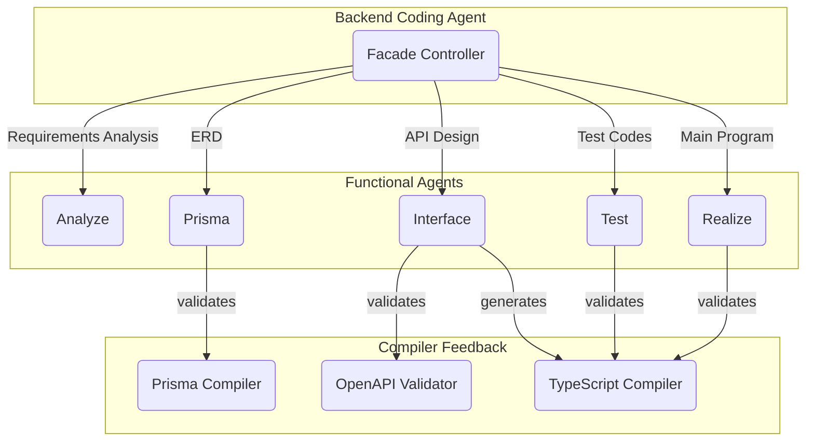
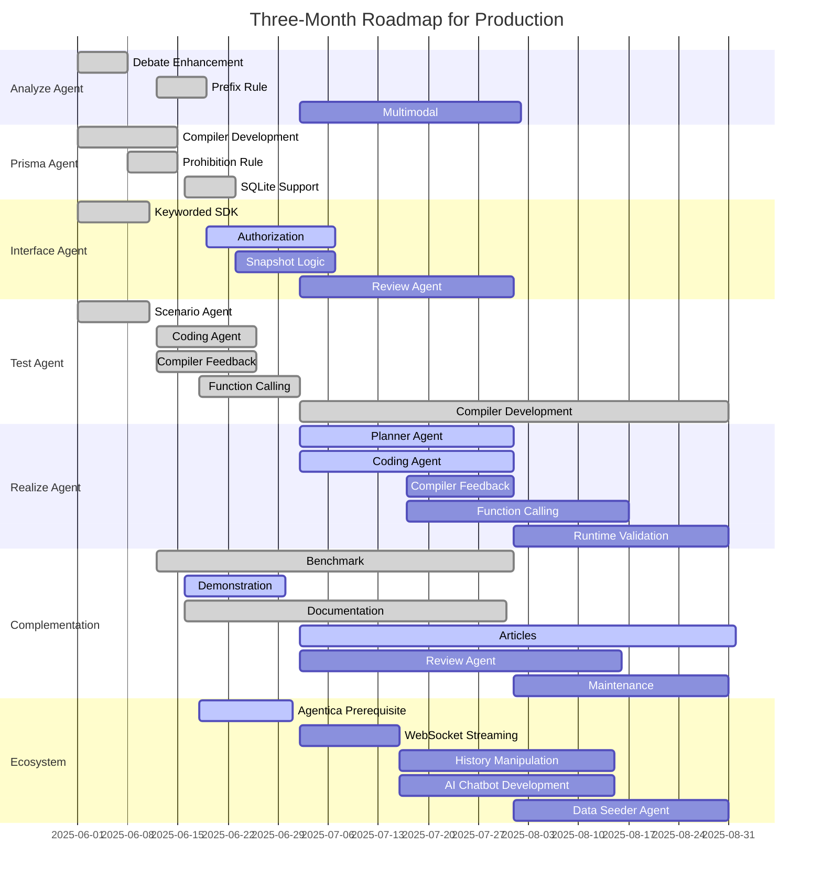

# AutoBE - No-Code Agent for Backend Applications

<div align="center"> 



[](https://github.com/wrtnlabs/autobe/blob/master/LICENSE)
[](https://www.npmjs.com/package/@autobe/agent)
[](https://www.npmjs.com/package/@autobe/agent)
[](https://github.com/wrtnlabs/autobe/actions?query=workflow%3Abuild)
[](https://wrtnlabs.io/autobe/docs/)
[](https://discord.gg/aMhRmzkqCx)

[](https://www.bloomberg.com/news/videos/2025-03-31/wtrn-on-series-b-funding-growth-strategy-video)
[](https://github.com/wrtnlabs)

</div>

An AI-powered no-code agent that builds backend applications, enhanced by compiler feedback.

`@autobe` is a no-code AI agent that analyzes user requirements and automatically generates backend applications using the stack below, following a waterfall development model. Since `@autobe`-generated code is validated by review agents and OpenAPI/TypeScript/Prisma compilers, it delivers 100% working code.

- TypeScript
- NestJS
- Prisma (Postgres / SQLite)

## Playground

https://github.com/user-attachments/assets/8c420015-d81a-4828-8e98-16522bc3ca3f

[https://stackblitz.com/github/wrtnlabs/autobe-playground-stackblitz](https://stackblitz.com/github/wrtnlabs/autobe-playground-stackblitz?file=md!README.md)

Experience the `@autobe` agent through our interactive playground above.

To see examples of backend applications generated by `@autobe`, explore these interactive demos. These showcase `@autobe`'s ability to generate production-ready backend code with proper structure, API documentation, and TypeScript interfaces. If you're unsure what to try, start with the BBS example script below.

- [BBS (Bulletin Board System)](https://stackblitz.com/github/wrtnlabs/autobe-example-bbs)
  1. I want to create a political/economic discussion board. Since I'm not familiar with programming, please write a requirements analysis report as you see fit.
  2. Design the database schema.
  3. Create the API interface specification.
  4. Make the e2e test functions.
- [E-Commerce](https://stackblitz.com/github/wrtnlabs/autobe-example-shopping)

## Documentation Resources

Find comprehensive resources at our [official website](https://wrtnlabs.io/autobe).

### 🏠 Home
- 🙋🏻‍♂️ [Introduction](https://wrtnlabs.io/autobe/docs)
- 📦 [Setup](https://wrtnlabs.io/autobe/docs/setup)
- 🔍 Concepts
  - [Waterfall Model](https://wrtnlabs.io/autobe/docs/concepts/waterfall)
  - [Compiler Strategy](https://wrtnlabs.io/autobe/docs/concepts/compiler)
  - [AI Function Calling](https://wrtnlabs.io/autobe/docs/concepts/function-calling)

### 📖 Features
- 🤖 Agent Library
  - [Facade Controller](https://wrtnlabs.io/autobe/docs/agent/facade)
  - [Configuration](https://wrtnlabs.io/autobe/docs/agent/config)
  - [Event Handling](https://wrtnlabs.io/autobe/docs/agent/event)
  - [Prompt Histories](https://wrtnlabs.io/autobe/docs/agent/history)
- 📡 WebSocket Protocol
  - [Remote Procedure Call](https://wrtnlabs.io/autobe/docs/websocket/rpc)
  - [NestJS Server](https://wrtnlabs.io/autobe/docs/websocket/nestjs)
  - [NodeJS Server](https://wrtnlabs.io/autobe/docs/websocket/nodejs)
  - [Client Application](https://wrtnlabs.io/autobe/docs/websocket/client)
- 🛠️ Backend Stack
  - [TypeScript](https://wrtnlabs.io/autobe/docs/stack/typescript)
  - [Prisma ORM](https://wrtnlabs.io/autobe/docs/stack/prisma)
  - [NestJS Framework](https://wrtnlabs.io/autobe/docs/stack/nestjs)

### 🔗 Appendix
- 🌐 [No-Code Ecosystem](https://wrtnlabs.io/autobe/docs/ecosystem)
- 📅 Roadmap
  - [Alpha Release (completed)](https://wrtnlabs.io/autobe/docs/roadmap/alpha)
  - [Beta Release (in progress)](https://wrtnlabs.io/autobe/docs/roadmap/beta)
  - [v1.0 Official Release (planned)](https://wrtnlabs.io/autobe/docs/roadmap/v1.0)
- 🔧 [API Documentation](https://wrtnlabs.io/autobe/api)

## No-Code Ecosystem


> A 70-year-old grandmother who grows tomatoes in the countryside created an online debate website in just 10 minutes. Despite being unfamiliar with coding or computers, she built this current affairs and [economics discussion community](https://stackblitz.com/github/wrtnlabs/autobe-example-bbs) simply by talking with Wrtn's AI. What's remarkable is that users can write posts and comments entirely through voice commands and even engage in current affairs debates with AI.
>
> The next day, the grandmother spent another 20 minutes launching an [agricultural products shopping mall](https://stackblitz.com/github/wrtnlabs/autobe-example-shopping). Customers can simply say "I'd like to order 2kg of tomatoes" to complete their purchase, while the grandmother manages everything from orders and shipping to inventory through simple chat conversations.

This is the vision that we, the [WrtnLabs](https://github.com/wrtnlabs) team, are pursuing. We aim to create a world where anyone can build backend servers, AI chatbots, and frontend applications without any coding knowledge—simply by conversing with AI.

To realize this vision, the [WrtnLabs](https://github.com/wrtnlabs) team is developing two additional projects: [`@agentica`](https://github.com/wrtnlabs/agentica) and [`@autoview`](https://github.com/wrtnlabs/autoview).

- **`@agentica`**: Automatically creates AI chatbots when you provide a `swagger.json` file
- **`@autoview`**: Automatically generates frontend applications when you provide a `swagger.json` file

You're not limited to just creating backends with `@autobe`. Once you've built a no-code backend application through `@autobe`, you can immediately create an AI chatbot and frontend applications alongside it.

Can you converse? Then you're a full-stack developer.

```typescript
import { Agentica, assertHttpController } from "@agentica/core";
import OpenAI from "openai";
import typia from "typia";

import { MobileFileSystem } from "./services/MobileFileSystem";

const agent = new Agentica({
  vendor: {
    api: new OpenAI({ apiKey: "********" }),
    model: "gpt-4o-mini",
  },
  controllers: [
    // functions from TypeScript class
    typia.llm.controller<MobileFileSystem, "chatgpt">(
      "filesystem",
      MobileFileSystem(),
    ),
    // functions from Swagger/OpenAPI
    assertHttpController({
      name: "shopping",
      model: "chatgpt",
      document: await fetch(
        "https://shopping-be.wrtn.ai/editor/swagger.json",
      ).then(r => r.json()),
      connection: {
        host: "https://shopping-be.wrtn.ai",
        headers: { Authorization: "Bearer ********" },
      },
    }),
  ],
});
await agent.conversate("I wanna buy MacBook Pro");
```

## Roadmap Schedule



`@autobe`'s comprehensive three-month beta development roadmap spans from 2025-06-01 through 2025-08-31, marking a critical phase in our journey toward production readiness.

Following the successful completion of our alpha release on 2025-05-31, we have established a robust foundation with fully developed Analysis, Prisma, and Interface Agents. These core components have successfully automated the most complex challenges in backend development: comprehensive requirements analysis, intelligent database architecture, and seamless API design. This achievement represents a significant milestone in our mission to completely automate backend application design.

The upcoming beta phase strategically focuses on delivering and refining the Test Agent and Realization Agent while ensuring system-wide stability and performance optimization across the entire `@autobe` ecosystem. Our ambitious target for 2025-08-31 is to achieve a breakthrough: a 100% reliable No-Code Agent platform that can autonomously handle any backend application development challenge without human intervention.