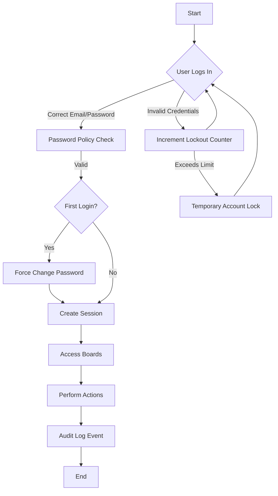

# 8. Security and Authentication

## Overview

Security and authentication are foundational elements of the Internal Bulletin Board System (IBBS), safeguarding sensitive company information and ensuring only authorized personnel can interact with internal communications. This section outlines all security controls, authentication and authorization policies, session management, and compliance expectations to guide robust and secure development of the system.

---

## 1. Login and Authentication Mechanisms

- **Company Email Login:**
  - Only valid company email addresses may be used for account sign-in—no external registration or guest access allowed for security.
  - Email verification upon first setup is required.

- **Initial Password and Forced Change:**
  - First-time login uses a pre-set initial password (e.g., "1234").
  - Users must change this password upon first access; system enforces password reset before access to other features.

- **Password Policy:**
  - Enforced minimum length (8+ characters), at least one uppercase, one lowercase, one number, and one special character.
  - Password history to prevent reuse of the last three passwords.
  - Account lockout after 5 failed login attempts (temporary lock for 15 minutes).

- **Password Reset:**
  - Secure password reset mechanism only for verified company emails.

---

## 2. Authorization and Access Control

- **Role-based Access:**
  - At least two user roles: Standard Employee and Administrator.
  - Granular permissions:
    - Only logged-in users can view/create posts/comments and use interactive features.
    - Administrators may moderate/delete/restore posts and access audit logs.
    - Employees cannot see posts or comments prior to authentication.

- **Board and Feature Access:**
  - All board content and like/comment capabilities are inaccessible until successful login.

---

## 3. Session Management

- **Session Security:**
  - Secure, HTTP-only cookies must be used for session tokens/IDs.
  - User sessions timeout after 30 minutes of inactivity; re-authentication required.
  - Explicit logout available from the UI.

- **Concurrent Sessions:**
  - Limit simultaneous active sessions per user to 3 (optional, for increased security).

---

## 4. Audit Logging and Monitoring

- **Critical Event Logging:**
  - Log all authentication events (login, logout, failed attempts, password change/reset).
  - Log administrative moderation actions (delete, restore, edit by admin).
  - Retain logs for a minimum of 6 months for traceability.

- **Access to Logs:**
  - Audit logs accessible only to administrators.

---

## 5. Protection Against Common Threats

- **Brute-force Protection:**
  - Temporary lockout on consecutive failed logins, as defined above.
  - CAPTCHA may be employed after multiple failures.

- **Data Transmission:**
  - All traffic must be encrypted via HTTPS; reject any non-secure requests.

- **CSRF/XSS Protections:**
  - Implement CSRF tokens for all authenticated changes (posting, commenting, likes).
  - Sanitize user input to prevent XSS vulnerabilities.

- **Like/Interaction Integrity:**
  - Server-side check to prevent duplicate likes (idempotent endpoints, atomic database operations).

---

## 6. Data Privacy, Retention, and Deletion

- **Data Deletion:**
  - Deleted posts and comments must be irrecoverably removed (hard delete), except as necessary for audit logs.
  - Any personal or access information in logs anonymized if required by policy or local regulations.

- **Data Storage:**
  - Passwords must be stored hashed and salted (never in plain text).

---

## 7. Compliance and Best Practices

- **Compliance with Company Policy:**
  - Adhere to all relevant internal security guidelines (ISO 27001, SOC 2, etc., as applicable).

- **Periodic Security Review:**
  - Conduct periodic vulnerability scanning and penetration tests (recommended at least annually).
  - Provide admin tools for reviewing access and activity histories.

- **User Education:**
  - Display password tips, security awareness prompts, and encourage responsible reporting of suspicious activity.

---

## 8. Practical Implementation Expectations

- Use industry-standard encryption libraries for credentials and traffic.
- Ensure authentication/authorization middleware is applied on all routes except login, password reset, and public error/info pages.
- Make use of session invalidation on password reset or suspected compromise.

---

## 9. Diagram – High-level Security Flow (Mermaid)

---

For supporting documents, see:
- [7_board_structure_and_content_management.md](7_board_structure_and_content_management.md)
- [6_non_functional_requirements.md](6_non_functional_requirements.md)
- [9_ui_ux_requirements.md](9_ui_ux_requirements.md)

Is there anything else to refine for this security and authentication specification?
