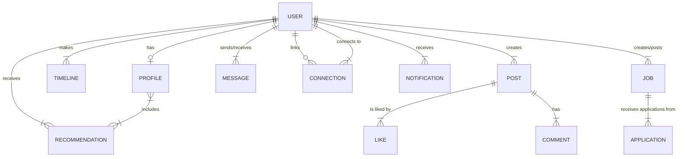

# 09. Data Model & Entity Relationship Diagram (ERD)

## 1. Overview
This document provides a comprehensive overview of the data model structure for the career-focused social networking platform. Clear definitions of each core entity and their relationships are presented to guide system architecture, ensure data consistency, and support future scalability. An ERD is included to visually represent the principal data objects and their integrations.

---

## 2. Core Entities & Descriptions

| Entity        | Description                                                                                 |
|--------------|---------------------------------------------------------------------------------------------|
| User         | The primary account for platform members, encompassing login credentials and user identity. |
| Profile      | Extended user information: personal, career, education, skills, awards, languages, etc.     |
| Timeline     | Chronological list of career activities, jobs, promotions, and project milestones.          |
| Post         | User-generated content—including status updates, articles, shared insights, or media.       |
| Connection   | Records of connection requests and approved professional relationships between users.        |
| Message      | 1:1 direct messages conducted between users for professional communication.                 |
| Notification | System-generated notifications regarding user activities, messages, and updates.            |
| Job          | Job postings and related information created by company/recruiter accounts.                 |
| Recommendation| Peer-written endorsements and recommendations attached to user Profiles.                   |

---

## 3. Key Relationships (Narrative)
- **User–Profile:** 1-to-1 — Every user has one unique profile.
- **User–Timeline:** 1-to-many — Each user may have numerous timeline entries.
- **User–Post:** 1-to-many — A user can author multiple posts.
- **User–Connection:** many-to-many (via Connection) — Users connect with peers, requiring mutual confirmation.
- **User–Message:** 1-to-many (as sender and receiver) — Users can initiate/receive multiple messages.
- **User–Recommendation:** 1-to-many — Users may write and receive recommendations.
- **Job–User:** many-to-1 — Jobs are posted by users with company/recruiter privileges.
- **Notification–User:** 1-to-many — Notifications pertain to user activities/events.

---

## 4. Entity Relationship Diagram (ERD)

---

## 5. Notes on Scalability and Security
- **Scalability**: Data entities are normalized and indexed for fast lookup and expandability. Timeline, Posts, and Messages are expected to be high-volume; partitioning and efficient querying are priorities.
- **Security & Privacy**: Personally identifiable information (PII) is contained in Profile; access is governed by user privacy settings. Messaging and connection information is strictly user-controlled.
- **Future Extension**: The schema is designed for easy expansion (e.g., group accounts, advanced analytics, API integrations).

---

## 6. Next Steps
For implementation details, refer to the [Functional Requirements](05_functional_requirements.md) and [Non-Functional Requirements](06_nonfunctional_requirements.md) documentation.

----

Is there anything that needs refinement for the data model, or shall we proceed to the next section: [10_search_recommendations.md]? 