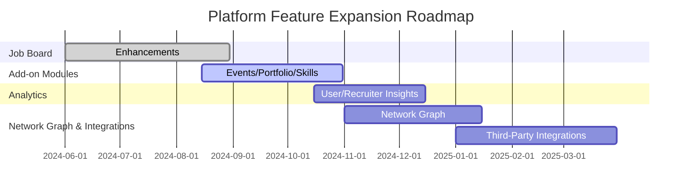

# 11. Future Scope: Career-Focused Social Networking Platform

## Overview
This document presents the planned future scope for the career-focused social networking platform, highlighting strategic enhancements and features targeted for post-MVP release. The aim is to ensure the platform evolves to address emerging market needs, drive continued user engagement, and foster ecosystem growth beyond initial launch.

---

## 1. Strategic Priorities & Roadmap

The future scope is organized into priority areas impacting platform growth:

### 1.1. Job Board Enhancements
- **Scheduled for Post-MVP, Q2/Q3**
- Improvements include: company dashboards, verified company badges, advanced filtering (location, experience, skill), job post analytics, bulk job posting, branded company pages.

### 1.2. Add-on Modules
- **Timeline: Q3/Q4**
- Potential modules:
    - **Events/Webinars:** Calendar of relevant professional events, RSVP, collaboration with educational partners for online learning.
    - **Portfolio Builder:** Advanced portfolio module for showcasing multi-media work samples.
    - **Skills Endorsements & Assessments:** Structured endorsements, integrated skills quizzes, and certifications for targeted professions.

### 1.3. Analytics & Insights
- **Timeline: Q4**
- Features:
    - **For Users:** Career trajectory analytics, profile views breakdown, engagement metrics, network growth visualization.
    - **For Employers:** Job posting effectiveness, candidate funnel analytics, brand engagement.

### 1.4. Network Graph Visualization
- **Timeline: Q4**
- Interactive visual map of users’ professional network, allowing users to discover 2nd/3rd-degree connections, common touchpoints, and influence paths.

### 1.5. Third-Party Integrations
- **Timeline: Q4 or Later**
- Potential integrations:
    - **Calendar & Email Sync:** Calendar sync with Google/Outlook, scheduling meetings with connections.
    - **Learning Platforms:** Integration with MOOCs (Coursera, Udemy).
    - **Applicant Tracking Systems (ATS):** Direct application with one-click from the platform.

---

## 2. Long-Term Vision
- **AI-Driven Career Guidance:** Personalized job matching, career coaching insights, automated resume review.
- **Globalization:** Multi-language support, region-specific features, compliance with global data standards.
- **Organizational Accounts:** Features for enterprise, consulting firms, startups (team management, brand campaigns).
- **Open API Ecosystem:** Provide APIs for partners to develop extensions, bots, analytics tools.

---

## 3. Feature Prioritization Table

| Feature Area                     | Priority    | MVP/Timeline      |
|----------------------------------|-------------|-------------------|
| Job Board Enhancements           | High        | Q2/Q3 (Post-MVP)  |
| Add-on Modules (Events, Portfolio, Endorsements)     | Medium-High | Q3/Q4             |
| Analytics & Insights             | Medium      | Q4                |
| Network Graph Visualization      | Medium      | Q4                |
| Third-Party Integrations         | Medium      | Q4+/TBD           |
| AI-Driven Career Tools           | Long-term   | Future Releases   |
| Organizational Accounts          | Long-term   | Future Releases   |
| Open API Ecosystem               | Long-term   | Future Releases   |

---

## 4. Proposed Implementation Phases (Illustrative Gantt)

---

## 5. Notes & Risks
- Feature priorities may shift based on user adoption, market feedback, and technical scalability.
- Compliance requirements (privacy, data localization) to be continuously monitored.
- Post-MVP additions will be rolled out with comprehensive user onboarding and marketing push to ensure adoption.

---

Is there anything else to refine or details to expand in the future scope plan? [Back to Requirement Report TOC](01_user_requirement_report_toc.md)
