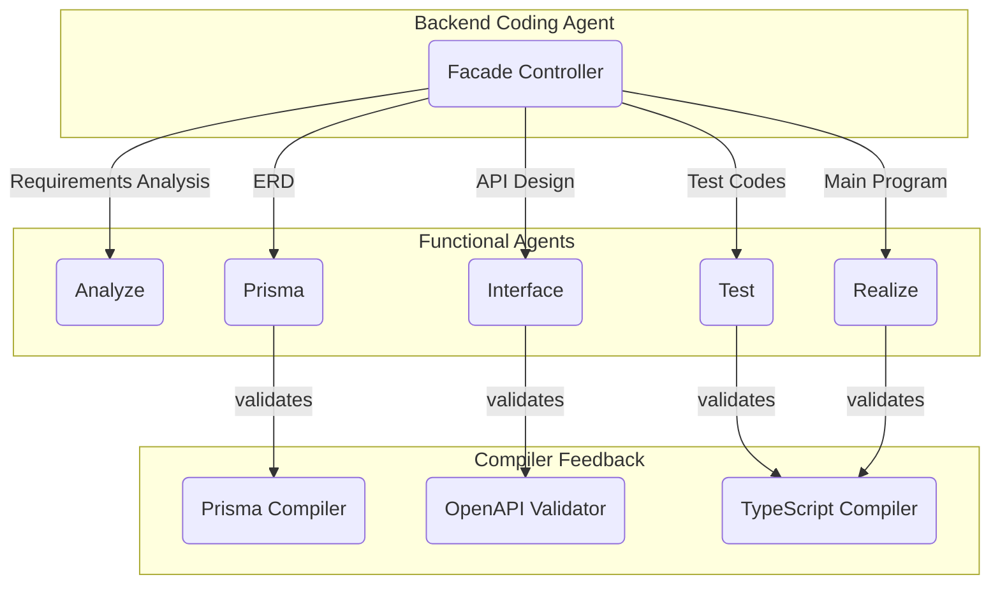
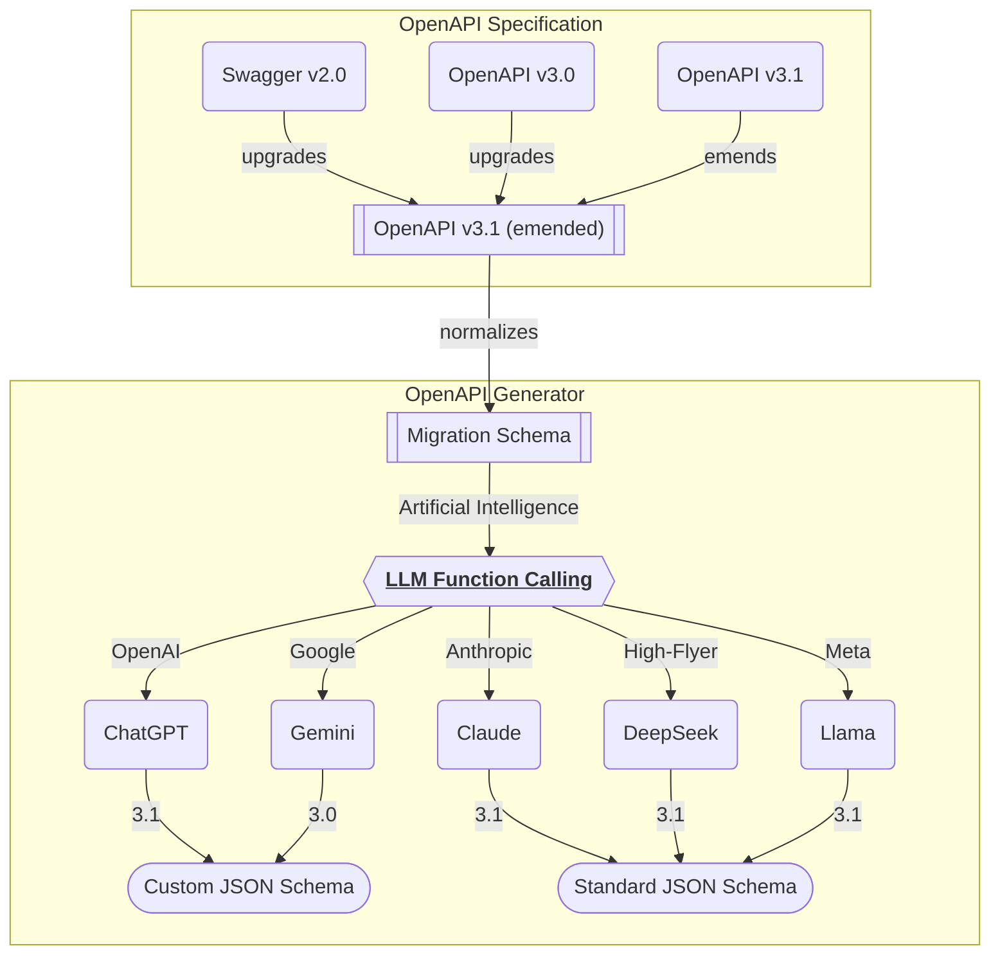
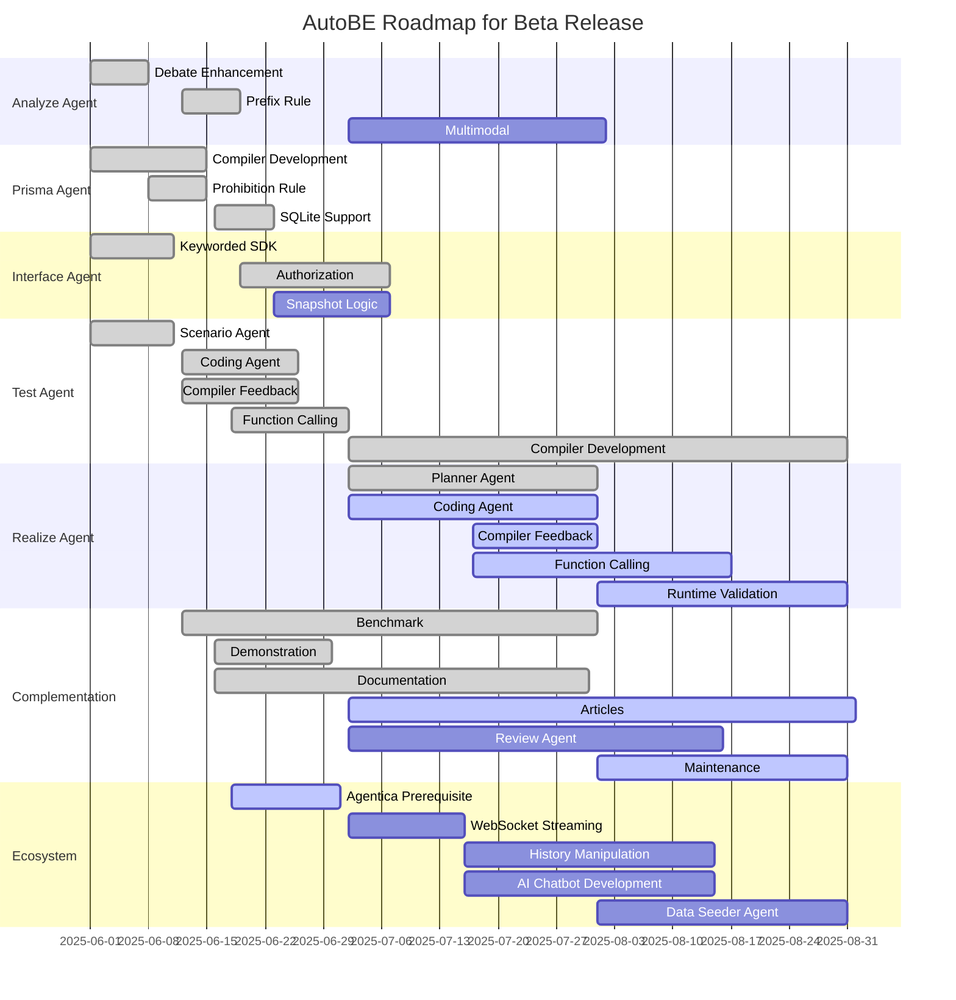

## Preface


> The video is sped up; it actually takes about 20-30 minutes

- Github Repository: https://github.com/wrtnlabs/autobe
- Generation Result: https://github.com/wrtnlabs/autobe-example-bbs

We are honored to introduce [`AutoBE`](https://github.com/wrtnlabs/autobe) to you. [`AutoBE`](https://github.com/wrtnlabs/autobe) is an open-source project developed by Wrtn Technologies (Korean AI startup company), a vibe coding agent that automatically generates backend applications.

One of [`AutoBE`](https://github.com/wrtnlabs/autobe)'s key features is that it always generates code with 100% compilation success. The secret lies in our proprietary compiler system. Through our self-developed compilers, we support AI in generating type-safe code, and when AI generates incorrect code, the compiler detects it and provides detailed feedback, guiding the AI to generate correct code.

Through this approach, [`AutoBE`](https://github.com/wrtnlabs/autobe) always generates backend applications with 100% compilation success. When AI constructs AST (Abstract Syntax Tree) data through function calling, our proprietary compiler validates it, provides feedback, and ultimately generates complete source code.

> **What is AI Function Calling?** AI Function Calling is a technology where AI generates structured data according to predefined function schemas. Unlike general text generation, it produces JSON data that adheres to specific types and formats, making it directly usable by programs.

## Waterfall Compiler System
### Outline


[`AutoBE`](https://github.com/wrtnlabs/autobe) generates backend applications through a compiler system based on the Waterfall model. The entire process consists of five sequential phases, each handled by dedicated agents.

The **Facade Controller** orchestrates the entire process, while functional agents perform tasks in sequence. The **Analyze** agent analyzes user requirements to create detailed functional specifications, the **Prisma** agent designs the database schema based on these specifications, the **Interface** agent defines API interfaces, the **Test** agent generates E2E test code, and finally the **Realize** agent writes the actual API implementation code.

The output of each agent is validated through corresponding dedicated compilers. The Prisma agent's output is validated by our self-developed Prisma compiler, the Interface agent's output by the OpenAPI validator, and the TypeScript code from Test and Realize agents by the TypeScript compiler. This phase-by-phase validation system is the core mechanism that guarantees 100% compilation success.

### Prisma DB Schema Compiler
A compiler for database design.

- Compiler Structures
  - [`AutoBePrisma.IFile`](https://github.com/wrtnlabs/autobe/blob/main/packages/interface/src/prisma/AutoBePrisma.ts)
  - [`IAutoBePrismaValidation`](https://github.com/wrtnlabs/autobe/blob/main/packages/interface/src/prisma/IAutoBePrismaValidation.ts)
  - [`IValidation`](https://github.com/samchon/openapi/blob/master/src/structures/IValidation.ts)
- Generation Result
  - Prisma Schema Files: https://github.com/wrtnlabs/autobe-example-bbs/tree/main/prisma/schema
  - ERD Documentation: https://github.com/wrtnlabs/autobe-example-bbs/blob/main/docs/ERD.md

[`AutoBE`](https://github.com/wrtnlabs/autobe) utilizes a self-developed DB compiler when designing databases.

First, it creates an AST (Abstract Syntax Tree) structure called `AutoBePrisma.IFile` through AI function calling (or structured output). Then it analyzes the data created by the AI to check for logical or type errors.

If logical errors are found, these are returned to the AI in the form of `IAutoBePrismaValidation` with detailed reasons, guiding the AI to generate correct `AutoBePrisma.IFile` data in the next function calling. Major logical error cases include:

- **Duplication errors**: Duplicate definitions of filenames, model names, field names
- **Circular references**: Cross-dependencies where two models reference each other as foreign keys
- **Non-existent references**: Cases where foreign keys point to non-existent target models
- **Index configuration errors**: Creating indexes on non-existent fields, duplicate index definitions
- **Data type mismatches**: Applying GIN indexes to non-string fields
- **Field names identical to table names**: Potential confusion due to normalization errors

If type errors are found, these are also returned to the AI in the form of `IValidation`, guiding the AI to generate data with correct types.

Finally, when `AutoBePrisma.IFile` is correctly generated without any logical or type errors, it is converted to Prisma DB schema (code generation). Simultaneously, ERD (Entity Relationship Diagram) and documentation are also generated ([`prisma-markdown`](https://github.com/samchon/prisma-markdown)), helping users understand their DB design.

The generated Prisma schema files include detailed descriptive comments for each table and field. These comments go beyond simple code documentation - they are directly utilized by `prisma-markdown` when generating ERDs and documentation, becoming core content of the database design documents. Therefore, developers can clearly understand the role of each table and field not only at the code level but also through visual ERD diagrams.

[](https://github.com/wrtnlabs/autobe-example-bbs/blob/main/docs/ERD.md)

### OpenAPI Document Compiler
A compiler for API interface design.

- Compiler Structures
  - [`AutoBeOpenApi.IDocument`](https://github.com/wrtnlabs/autobe/blob/main/packages/interface/src/openapi/AutoBeOpenApi.ts)
  - [`IValidation`](https://github.com/samchon/openapi/blob/master/src/structures/IValidation.ts)
- Generation Result: https://stackblitz.com/edit/njkqikge

[`AutoBE`](https://github.com/wrtnlabs/autobe) utilizes a self-developed OpenAPI compiler when designing API interfaces.

This OpenAPI compiler first has an AST (Abstract Syntax Tree) structure of type `AutoBeOpenApi.IDocument`, which is created through AI function calling. Then it analyzes this data, and if logical or type errors are found, detailed reasons are returned to the AI, guiding the AI to generate correct `AutoBeOpenApi.IDocument` data.

After the AI successfully generates a flawless `AutoBeOpenApi.IDocument`, [`AutoBE`](https://github.com/wrtnlabs/autobe) converts it to the official OpenAPI v3.1 spec [`OpenApi.IDocument`](https://github.com/samchon/openapi/blob/master/src/OpenApi.ts) structure. This is then further converted to TypeScript/NestJS source code (code generation), completing the API interface implementation.

The generated TypeScript/NestJS source code consists of API controller classes and DTO (Data Transfer Object) types, where each API controller method is a mock method that only generates random values of the specified return type using the [`typia.random<T>()`](https://typia.io/docs/random) function. Therefore, APIs generated by [`AutoBE`](https://github.com/wrtnlabs/autobe) don't actually function, but they complete the foundational work for API interface design and implementation.

All generated controller functions and DTO types include detailed JSDoc comments. The purpose of each API endpoint, parameter descriptions, and meanings of return values are clearly documented, making it easy for developers to understand the purpose and usage of APIs.

[](https://stackblitz.com/edit/njkqikge)

### E2E Test Function Compiler
A compiler for generating E2E test programs.

- Compiler Structures
  - [`AutoBeTest.IFunction`](https://github.com/wrtnlabs/autobe/blob/main/packages/interface/src/test/AutoBeTest.ts)
  - [`IAutoBeTypeScriptCompileResult`](https://github.com/wrtnlabs/autobe/blob/main/packages/interface/src/compiler/IAutoBeTypeScriptCompileResult.ts)
  - [`IValidation`](https://github.com/samchon/openapi/blob/master/src/structures/IValidation.ts)
- Prompt Structures
  - [`IAutoBeTestWriteApplication`](https://github.com/wrtnlabs/autobe/blob/main/packages/agent/src/orchestrate/test/structures/IAutoBeTestWriteApplication.ts#L4)
  - [`IAutoBeTestCorrectApplication`](https://github.com/wrtnlabs/autobe/blob/main/packages/agent/src/orchestrate/test/structures/IAutoBeTestCorrectApplication.ts)
- Generation Result: https://github.com/wrtnlabs/autobe-example-bbs

[`AutoBE`](https://github.com/wrtnlabs/autobe) uses a self-developed compiler when generating E2E test code.

This E2E test compiler has an AST (Abstract Syntax Tree) structure called `AutoBeTest.IFunction`, which is constructed through AI function calling. Then it analyzes this data, and if logical or type errors are found, detailed reasons are returned to the AI, guiding the AI to generate correct `AutoBeTest.IFunction` data.

After the AI successfully generates flawless `AutoBeTest.IFunction` data, [`AutoBE`](https://github.com/wrtnlabs/autobe) converts it to TypeScript source code (code generation). The Test agent then combines each of the generated e2e test functions with the code generated by the interface agent to complete a new backend application.

When E2E test functions call backend server API functions, they use an SDK (Software Development Kit) generated for the backend server API to ensure type-safe API function calls.

Each generated E2E test function includes detailed comments describing the test's scenario and purpose. Which APIs are called in what order, what is verified at each step, and what results are expected are clearly documented, making it easy to understand the intent of the test code.

[](https://github.com/wrtnlabs/autobe-example-bbs)

> When the backend application stack generated by [`AutoBE`](https://github.com/wrtnlabs/autobe) is TypeScript/NestJS, [`AutoBE`](https://github.com/wrtnlabs/autobe) does not construct `AutoBeTest.IFunction` data through AI structured output.
> 
> Instead, it uses AI structured output where the AI devises scenarios for given API endpoints, writes draft test code, then reviews and revises it to write the final code. The code written by AI is then verified through the TypeScript compiler API, and if compilation fails, detailed reasons are returned to the AI, guiding it to generate correct code.
>
> However, this method is only possible with the TypeScript/NestJS stack. For other languages and stacks, `AutoBeTest.IFunction` data is still constructed and compiled through AI function calling.
>
> ```typescript
> typia.llm.parameters<{
>   scenario: string; // test scenario
>   draft: string; // the draft code written by AI
>   review: string; // self-review about the draft code
>   final: string; // the final code after review
> }, "chatgpt">();
> ```

## Additional Resources
### TypeScript Compiler
TypeScript compiler embedding.

- [`IAutoBeTypeScriptCompiler`](https://github.com/wrtnlabs/autobe/blob/main/packages/interface/src/compiler/IAutoBeTypeScriptCompiler.ts)
- [`IAutoBeTypeScriptCompileProps`](https://github.com/wrtnlabs/autobe/blob/main/packages/interface/src/compiler/IAutoBeTypeScriptCompileProps.ts)
- [`IAutoBeTypeScriptCompileResult`](https://github.com/wrtnlabs/autobe/blob/main/packages/interface/src/compiler/IAutoBeTypeScriptCompileResult.ts)

[`AutoBE`](https://github.com/wrtnlabs/autobe) embeds the TypeScript compiler to perform final validation of TypeScript source code generated by AI or [`AutoBE`](https://github.com/wrtnlabs/autobe)'s built-in compilers.

### AI Function Calling Compiler
A compiler for AI function calling and validation feedback.

- Compiler Functions
  - [`typia.llm.application<App, Model>()`](https://typia.io/docs/llm/application/): AI function calling
  - [`typia.llm.parameters<Params, Model>()`](https://typia.io/docs/llm/parameters/): AI structured output
- AST Structures
  - [`AutoBePrisma.IFile`](https://github.com/wrtnlabs/autobe/blob/main/packages/interface/src/prisma/AutoBePrisma.ts)
  - [`AutoBeOpenApi.IDocument`](https://github.com/wrtnlabs/autobe/blob/main/packages/interface/src/openapi/AutoBeOpenApi.ts)
  - [`AutoBeTest.IFunction`](https://github.com/wrtnlabs/autobe/blob/main/packages/interface/src/test/AutoBeTest.ts)

The secret to [`AutoBE`](https://github.com/wrtnlabs/autobe)'s ability to generate backend applications with 100% compilation success lies in its self-developed compilers and the creation of all their AST (Abstract Syntax Tree) structures through AI function calling.

However, like all compiler AST structures in the world, these are literally tree structures with recursive reference relationships, and their hierarchy and complexity are indescribably high. While JSON schemas used for AI function calling or structured output are typically hand-written by humans, the AST structures for [`AutoBE`](https://github.com/wrtnlabs/autobe)'s compilers are too large, complex, and intricate for humans to write their JSON schemas manually.

Moreover, JSON schemas used for AI function calling vary in specification across AI vendors. OpenAI and Gemini have even created their own specifications instead of using standard JSON schema definitions, while Claude, which follows standard JSON schema definitions, ironically defines types using the outdated JSON schema v7 specification in its own MCP guide. The JSON schema specifications for AI function calling are truly chaotic.

Therefore, while it's generally recommended to avoid complex types and define them simply when creating AI agents using AI function calling or structured output, [`AutoBE`](https://github.com/wrtnlabs/autobe) cannot do so because it must express compiler AST structures.

> Gemini does not support union types, making it unusable in [`AutoBE`](https://github.com/wrtnlabs/autobe).



To solve this problem, [`AutoBE`](https://github.com/wrtnlabs/autobe) team developers created [`typia`](https://github.com/samchon/typia), a TypeScript compiler plugin library that automatically generates AI function calling and structured output schemas from TypeScript source code, and integrated it into [`AutoBE`](https://github.com/wrtnlabs/autobe).

When you specify the target type and AI model as shown below, [`typia`](https://github.com/samchon/typia) automatically creates AI function calling and structured output schemas. Additionally, when calling [`typia.llm.application<Class, Model>()`](https://typia.io/docs/llm/application), it also generates validator functions for type validation feedback for all methods within that class type.

[`AutoBE`](https://github.com/wrtnlabs/autobe) has implemented a Vibe coding agent with 100% compilation success by actively utilizing compiler technology both internally and externally.

- `typia.llm.parameters<AutoBeOpenApi.IDocument, "chatgpt">()`
- `typia.llm.parameters<AutoBeOpenApi.IDocument, "claude">()`
- `typia.llm.parameters<AutoBeOpenApi.IDocument, "llama">()`

[](https://typia.io/playground/?script=JYWwDg9gTgLgBAbzgeTAUwHYEEzDgXzgDMoIQ4AiAAQGcBDEAYwAsIMB6CdDO3CgbgBQoSLDgwAnrjrFS5CpOkDBgxmxrxeYOAF5xU4HQB0AGxMgjWk8EZ0YwNgB5BcRC9dwA7lGAw0ACjAALhRuHGAjAEkAEQhGAFcQTBgAShCANwhgABMhV3wAGncKFjsAczAYCkEAPn8UoTUMGggTNFMIMv93LSMieIxGe3UAbQAGAF0jdLprbLsApHdXGZN4tBCKbzYyuHmYOgoCuHd8FKKGoA)

## Backend Stack
### TypeScript / NestJS / Prisma
[`AutoBE`](https://github.com/wrtnlabs/autobe) currently supports the TypeScript/NestJS/Prisma backend stack combination.

The primary reason for choosing **TypeScript** is that its compiler and API are completely open-source and extensible through a plugin system. To implement [`AutoBE`](https://github.com/wrtnlabs/autobe)'s core compiler-based architecture, we needed to deeply utilize the language's own compiler, and TypeScript perfectly met these requirements. Additionally, its powerful type system allows us to guarantee the type safety of AI-generated code, which was essential for achieving our goal of 100% compilation success.

**NestJS** realizes [`AutoBE`](https://github.com/wrtnlabs/autobe)'s core functionality through its combination with [Nestia](https://nestia.io/docs/sdk). Nestia is a tool that analyzes NestJS source code to automatically generate client SDK libraries, enabling [`AutoBE`](https://github.com/wrtnlabs/autobe)'s generated E2E test programs to perform completely type-safe API calls. Common issues in typical REST API testing such as URL typos, parameter type mismatches, and response structure changes are all detected at compile time, significantly improving test code reliability.

**Prisma** handles database schema management and type-safe query generation. Prisma's schema definition language is structured, making it suitable for [`AutoBE`](https://github.com/wrtnlabs/autobe)'s compiler to parse and validate. The generated TypeScript client ensures complete type safety in database operations as well. Additionally, its migration system allows systematic management of database schema changes, helping maintain consistency between development and production environments.

This combination of three technologies was the optimal choice for achieving [`AutoBE`](https://github.com/wrtnlabs/autobe)'s goals of "compiler-based code generation" and "100% compilation success."

### Other Languages and Frameworks
[`AutoBE`](https://github.com/wrtnlabs/autobe)'s architecture is designed to be language and framework agnostic. The core principle is that AI generates AST structures through function calling, which are then converted to source code in the respective language.

Currently, we only support the TypeScript/NestJS/Prisma combination, but theoretically, expansion to other languages and frameworks is entirely possible. For example, to expand to combinations like Java/Spring Boot, Python/FastAPI, or Go/Gin, we would need to define appropriate AST structures for each language and develop corresponding compilers or validation systems.

However, language-specific expansion requires significant development investment. We must deeply understand each language's unique type system, compiler characteristics, and framework structures, and build validation systems that can guarantee [`AutoBE`](https://github.com/wrtnlabs/autobe)'s core value of "100% compilation success." Currently, we are focused on improving completeness within the TypeScript stack, and will consider supporting other languages based on user demand and project development direction in the future.

## Development Status and Roadmap


[`AutoBE`](https://github.com/wrtnlabs/autobe)'s current development stage is alpha version, with not all features completed yet.

First, among the five phases that constitute the waterfall model, the realize agent is not yet completed. Therefore, while it's possible to generate requirements analysis reports, design DB and APIs, and write E2E test code for them through [`AutoBE`](https://github.com/wrtnlabs/autobe), it's not yet possible to actually implement API functions to complete applications. This realize agent is currently under development and is scheduled to be released with the beta release on August 31, 2025.

Second, [`AutoBE`](https://github.com/wrtnlabs/autobe)'s prompts are not yet optimized. Therefore, while the code generated by [`AutoBE`](https://github.com/wrtnlabs/autobe) can compile successfully and function well, it may not truly be the functionality users want.

Finally, [`AutoBE`](https://github.com/wrtnlabs/autobe) has not yet started RAG optimization. Therefore, API token consumption may be higher than expected. Based on the GPT-4.1 model, generating a backend application with 200 APIs consumes approximately $30. This will be gradually reduced through future RAG optimization.

## Conclusion

[`AutoBE`](https://github.com/wrtnlabs/autobe) has taken a different approach from existing AI coding tools. Instead of relying on text-based code generation, we implemented structurally safe code generation by combining compiler technology with AI.

Through this approach where AI directly generates ASTs, compilers validate them, and perfect code is created through feedback, we achieved 100% compilation success. This is an attempt to fundamentally improve software development quality and stability, beyond mere convenience enhancement.

Currently, [`AutoBE`](https://github.com/wrtnlabs/autobe) is in alpha version state, requiring more development until the beta release. However, we believe this compiler-based approach can present new possibilities to developers. We thank those who have shown interest in the [`AutoBE`](https://github.com/wrtnlabs/autobe) project and ask you to continue following our development progress.

https://github.com/wrtnlabs/autobe