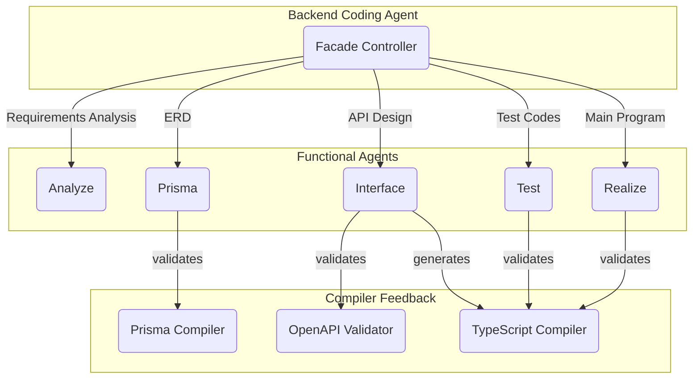

# 제 1차 AutoBE 해커톤 대회 안내

## 1. 개요

Wrtn Technologies에서 제 1차 AutoBE 해커톤 대회를 개최합니다.

- **참여 인원**: 70명
- **모집 기간**: 2025년 9월 5일 ~ 9월 10일
- **대회 일정**: 2025년 9월 13일 ~ 14일 (48시간)
  - 시작: 9월 13일 00:00:00 (KST)
  - 종료: 9월 14일 23:59:59 (KST)

백엔드 개발자 여러분께 묻고 싶습니다. AI가 정말로 백엔드 개발자의 일을 대체할 수 있을까요? 우리는 이 질문에 대한 답을 현장에서 직접 일하고 계신 개발자분들로부터 듣고자 합니다.

AutoBE는 자연어 대화만으로 백엔드 애플리케이션을 자동으로 생성하는 AI 기반 노코드 플랫폼입니다. AutoBE의 AI 챗봇과 요구사항에 대해 대화를 나누면, AutoBE가 이를 정리하여 요구사항 정의서를 작성하고, 데이터베이스 스키마를 설계하며, API를 정의하고, 테스트 코드를 작성한 뒤, 최종적으로 빌드에 성공하는 백엔드 애플리케이션을 구현합니다. 하지만 과연 이렇게 생성된 코드가 실제 프로덕션 환경에서 사용할 만한 수준일까요? 어쩌면 일견 그럴싸하기만 한 코드 조각일 뿐, 사용자가 원하는 것과는 다른 백엔드 어플리케이션이 만들어진 것은 아닐까요?

이번 해커톤은 바로 이 점을 검증하기 위해 기획되었습니다. 우리는 실제 백엔드 개발 경험을 가진 개발자분들이 AutoBE를 직접 사용해보고, 전문가의 관점에서 솔직하고 날카로운 평가를 해주시길 기대합니다. AutoBE가 생성한 백엔드 애플리케이션이, 진정 여러분이 원했던 바와 일치하는지 알려주세요. 여러분의 비판적인 시각과 전문적인 분석이 AutoBE를 더 나은 도구로 발전시키는 데 핵심적인 역할을 할 것입니다.

### 1.1. 모집 대상

이번 해커톤에는 최소 1년 이상의 백엔드 개발 실무 경험을 보유한 개발자분들이 참여하실 수 있습니다. 우리가 찾는 개발자는 단순히 코드를 작성할 줄 아는 사람이 아니라, 좋은 코드와 나쁜 코드를 구분할 수 있고, 아키텍처의 장단점을 평가할 수 있으며, 실제 서비스 운영 경험을 바탕으로 현실적인 피드백을 제공할 수 있는 분들입니다.

특히 다음과 같은 경험과 관심을 가진 개발자분들의 참여를 환영합니다. AI 코드 생성 도구의 한계와 가능성에 대해 깊이 있는 통찰을 가지고 계신 분, 새로운 개발 패러다임의 등장이 개발자 커뮤니티에 미칠 영향을 고민해보신 분, 그리고 무엇보다 자신의 전문성을 바탕으로 신기술을 객관적으로 평가할 수 있는 분들을 모시고자 합니다.

### 1.2. 대회 정보

모집 기간은 2025년 9월 5일부터 9월 10일까지이며, 실제 해커톤은 9월 13일 자정부터 9월 14일 자정 직전까지 정확히 48시간 동안 진행됩니다. 한국 표준시 기준으로 9월 13일 00:00:00에 시작하여 9월 14일 23:59:59에 종료됩니다.

총 상금 규모는 5,000달러로, 가장 우수한 평가를 제출해주신 분께는 2,000달러, 그 다음으로 우수한 평가를 해주신 분께는 1,000달러를 지급합니다. 또한 성실하게 참여하고 의미 있는 피드백을 제공해주신 모든 참가자분들께는 50달러의 참가상을 지급할 예정입니다.

### 1.3. 차기 해커톤 예고

이번 제1차 해커톤은 선착순 70명으로 제한하여 진행합니다. 이렇게 참가자를 제한하는 가장 큰 이유는 AI 토큰 사용 비용 때문입니다. 

AutoBE는 그동안 각 에이전트가 얼마나 합리적인 설계를 하고 코드를 작성하는지, 그리고 AI 전용 컴파일러가 기대한대로 정상 동작하는지 등 각 유닛에 대한 구현 및 테스팅에만 집중해왔습니다. 덕분에 높은 품질의 백엔드 애플리케이션을 생성할 수 있게 되었지만, RAG(Retrieval-Augmented Generation)와 같은 AI 토큰 사용량 최적화는 아직 이루어지지 않았습니다.

현재 AutoBE로 대규모 이커머스 플랫폼을 생성하는 데 약 1.5억 토큰이 소모되며, 이는 300달러의 비용에 해당합니다. 이러한 비용 구조로는 수백 명이 참여하는 대규모 해커톤을 개최하기에 부담이 너무 큽니다. 

하지만 걱정하지 마세요. 다음 해커톤에서는 RAG 기술을 도입하여 토큰 사용량을 획기적으로 줄이고, 훨씬 더 많은 개발자분들이 참여할 수 있는 성대한 행사로 준비하겠습니다. 이번 해커톤은 그 첫 걸음입니다.

## 2. AutoBE란 무엇인가

AutoBE는 AI 친화적 컴파일러로 강화된, 백엔드 애플리케이션을 구축하는 바이브 코딩 에이전트입니다.

- Github Repository: https://github.com/wrtnlabs/autobe
- Guide Documents: https://wrtnlabs.io/wrtnlabs/autobe/docs

AutoBE는 AI 기반 노코드 백엔드 자동 생성 플랫폼으로, 자연어 요구사항만으로 완전히 작동하는 프로덕션급 백엔드 애플리케이션을 생성합니다. 기존의 AI 코드 생성 도구들이 가진 근본적인 한계, 즉 생성된 코드가 실제로 컴파일되지 않거나 실행되지 않는 문제를 해결하기 위해 우리는 컴파일러-인-더-루프(Compiler-in-the-Loop) 방식이라는 혁신적인 접근법을 도입했습니다.

100% 빌드 성공률을 자랑하는 백엔드 애플리케이션 생성 전용 바이브 코딩 에이전트(OpenAI GPT 4.1 기준), 그것이 바로 AutoBE입니다.

### 2.1. 작동 원리

AutoBE는 전통적인 소프트웨어 공학의 워터폴 모델을 AI 시대에 맞게 재해석한 5단계 프로세스를 따릅니다. 각 단계는 전문화된 AI 에이전트가 담당하며, 모든 단계에서 컴파일러가 실시간으로 검증을 수행합니다.

첫 번째 단계인 Analyze Agent는 사용자가 자연어로 입력한 요구사항을 체계적으로 분석합니다. 단순히 기능 목록을 나열하는 것이 아니라, 비즈니스 로직을 이해하고, 다양한 사용자 페르소나를 도출하며, 각 사용자의 권한과 역할을 정의합니다. 이 과정에서 모호하거나 충돌하는 요구사항을 식별하고 명확히 합니다.

두 번째 단계인 Prisma Agent는 요구사항을 바탕으로 데이터베이스 스키마를 설계합니다. 엔티티 간의 관계를 파악하고, 적절한 정규화를 적용하며, 인덱스 전략을 수립합니다. Prisma ORM의 스키마 정의 언어를 사용하여 타입 안전한 데이터 모델을 생성하고, 이는 즉시 Prisma 컴파일러에 의해 검증됩니다.

세 번째 단계인 Interface Agent는 RESTful API를 설계합니다. 각 엔드포인트의 HTTP 메소드, URI, 요청/응답 형식을 정의하고, OpenAPI 3.1 스펙에 따라 완전한 API 문서를 생성합니다. 이 문서는 AutoBE 전용 OpenAPI 컴파일러를 통과해야만 다음 단계로 진행됩니다.

네 번째 단계인 Test Agent는 E2E 테스트 코드를 작성합니다. 실제 사용자의 행동 패턴을 시뮬레이션하는 테스트 시나리오를 만들고, 정상적인 경우뿐만 아니라 엣지 케이스와 에러 상황도 포함합니다. 생성된 테스트 코드는 실제로 실행 가능해야 하며, 이는 테스트 러너에 의해 검증됩니다.

마지막 단계인 Realize Agent는 실제 백엔드 코드를 구현합니다. NestJS 프레임워크를 기반으로 컨트롤러, 서비스, 리포지토리 계층을 구현하고, 의존성 주입, 미들웨어, 가드 등의 고급 기능도 자동으로 처리합니다. 최종 코드는 TypeScript 컴파일러와 NestJS 빌더를 통과해야 합니다.

### 2.2. 기술적 특징

AutoBE의 가장 큰 특징은 각 단계마다 전문 컴파일러가 통합되어 있다는 점입니다. AI가 생성한 코드가 문법적으로 올바른지, 타입이 일치하는지, 실제로 실행 가능한지를 실시간으로 검증합니다. 컴파일 에러가 발생하면 AI는 즉시 피드백을 받아 코드를 수정하고, 이 과정은 완전한 코드가 생성될 때까지 반복됩니다.

특히 AutoBE의 핵심 경쟁력은 Prisma, Interface, Test 세 영역에서 독자적으로 개발한 AI 전용 컴파일러입니다. 일반적인 개발 도구와 달리, 이 컴파일러들은 AI의 특성을 깊이 이해하고 최적화되어 있습니다:

**AI 전용 Prisma 컴파일러**는 단순히 스키마 문법을 검증하는 것을 넘어, AI가 설계한 데이터 모델의 논리적 일관성과 관계의 적절성을 평가합니다. AI가 생성하기 쉬운 순환 참조나 불필요한 중복 관계를 사전에 감지하고 피드백을 제공합니다.

**AI 전용 Interface 컴파일러**는 OpenAPI 3.1 스펙 준수 여부뿐만 아니라, API 설계의 RESTful 원칙 준수도, 엔드포인트 간의 일관성, 그리고 요청/응답 구조의 완전성을 종합적으로 검증합니다. AI가 놓치기 쉬운 인증 헤더나 에러 응답 형식의 누락도 자동으로 감지합니다.

**AI 전용 Test 컴파일러**는 생성된 테스트 코드가 단순히 실행 가능한 수준을 넘어, 실제로 의미 있는 검증을 수행하는지 분석합니다. 테스트 커버리지, 엣지 케이스 포함 여부, 그리고 테스트 시나리오의 현실성을 평가하여 AI에게 개선 방향을 제시합니다.

이 컴파일러들의 가장 큰 차별점은 AI와의 소통 방식에 있습니다. 일반 컴파일러가 단순히 "에러가 있다"고만 알려준다면, AutoBE의 컴파일러는 "왜 문제인지", "어떻게 수정해야 하는지"를 AI가 이해할 수 있는 방식으로 상세히 피드백합니다. 이러한 긴밀한 협업이 100% 빌드 성공률의 비결입니다.

AutoBE의 또 다른 혁신은 AST(Abstract Syntax Tree) 기반의 구조화된 코드 생성 방식입니다. AI는 자연어 요구사항을 분석한 후, 미리 정의된 AST 구조에 맞춰 function calling을 통해 데이터를 생성합니다. 이는 마치 AI가 코드를 "작성"하는 것이 아니라 "조립"하는 것과 같습니다. 생성된 AST는 각 컴파일러에 의해 검증되고, 최종적으로 실제 사용 가능한 코드로 변환됩니다.

각 컴파일러의 AST 구조는 GitHub에서 확인할 수 있습니다:
- **Prisma 컴파일러**: [`AutoBePrisma.IApplication`](https://github.com/wrtnlabs/autobe/blob/main/packages/interface/src/prisma/AutoBePrisma.ts)
- **Interface 컴파일러**: [`AutoBeOpenApi.IDocument`](https://github.com/wrtnlabs/autobe/blob/main/packages/interface/src/openapi/AutoBeOpenApi.ts) 
- **Test 컴파일러**: [`AutoBeTest.IFunction`](https://github.com/wrtnlabs/autobe/blob/main/packages/interface/src/test/AutoBeTest.ts)

이러한 구조화된 접근 방식은 AI가 생성하는 코드의 일관성과 품질을 보장합니다. 더불어 컴파일러가 효과적으로 검증할 수 있는 기반을 제공하여, AI와 컴파일러가 하나의 팀처럼 작동하게 만듭니다.

또한 AutoBE는 TypeScript, NestJS, Prisma ORM, PostgreSQL/SQLite 등 현대적이고 검증된 기술 스택을 사용합니다. 이는 생성된 코드가 실제 프로덕션 환경에서 사용되는 것과 동일한 표준을 따른다는 것을 의미합니다.

## 3. 해커톤의 목적

AutoBE는 이론적으로는 완벽해 보입니다. 체계적인 프로세스, 컴파일러 검증, 현대적인 기술 스택 등 모든 요소가 갖춰져 있습니다. 실제로 생성된 코드는 컴파일되고 실행되며, 테스트도 통과합니다. 하지만 우리는 한 가지 중요한 질문에 대한 답을 아직 갖고 있지 않습니다. 

과연 AutoBE가 생성한 백엔드 애플리케이션이 사용자가 원했던 바로 그것일까요?

지금까지 우리 개발팀은 AutoBE의 각 구성 요소가 올바르게 작동하는지에 집중해왔습니다. 컴파일러들이 정확히 검증을 수행하는지, 에이전트들이 적절한 코드를 생성하는지, 전체 시스템이 안정적으로 동작하는지를 테스트했습니다. 하지만 이는 모두 기술적인 관점에서의 검증이었습니다.

실제 개발 현장에서는 기술적 완성도만큼이나 중요한 것이 있습니다. 생성된 코드가 유지보수하기 쉬운가? 아키텍처가 확장 가능한가? 성능 최적화는 적절히 되어 있는가? 보안 취약점은 없는가? 무엇보다도, 개발자가 보기에 "좋은 코드"인가?

이러한 질문들에 답하기 위해서는 실제 백엔드 개발 경험을 가진 전문가들의 평가가 필요합니다. AI를 통한 자동화된 코드 리뷰도 가능하겠지만, 우리는 사람의 직관과 경험에서 나오는 통찰력을 더 신뢰합니다. 특히 "이 코드를 내가 인수인계 받는다면 어떨까?"라는 관점에서의 평가는 오직 실제 개발자만이 할 수 있습니다.

### 3.1. 우리가 듣고 싶은 이야기

우리는 여러분으로부터 단순한 칭찬이나 비난이 아닌, 구체적이고 실질적인 피드백을 듣고 싶습니다. AutoBE가 생성한 요구사항 정의서가 실제 프로젝트에서 사용하는 것과 비교했을 때 어떤 차이가 있는지, 데이터베이스 설계가 장기적으로 봤을 때 합리적인지, API 설계가 RESTful 원칙을 제대로 따르고 있는지, 테스트 코드가 실제로 의미 있는 검증을 수행하는지, 그리고 최종 구현 코드가 프로덕션 레벨의 품질을 갖추고 있는지를 평가해주시기 바랍니다.

또한 AutoBE가 생성한 코드가 여러분이 직접 작성했을 때와 비교하여 어떤 차이가 있는지도 궁금합니다. 더 나은 부분이 있다면 무엇인지, 부족한 부분이 있다면 어떤 점인지, 그리고 개선을 위해서는 어떤 방향으로 나아가야 하는지에 대한 의견을 듣고 싶습니다.

무엇보다도, AutoBE가 실제로 개발자의 생산성을 향상시킬 수 있는 도구인지, 아니면 단순히 흥미로운 기술 데모에 불과한지에 대한 여러분의 솔직한 평가를 기대합니다.

## 4. 참가 자격 및 조건

이번 해커톤은 백엔드 개발 분야에서 최소 1년 이상의 실무 경험을 보유한 개발자를 대상으로 합니다. 단순히 학습 목적으로 백엔드 개발을 경험해본 것이 아니라, 실제 서비스를 개발하고 운영해본 경험이 있어야 합니다.

구체적으로는 다음과 같은 기술 스택 중 하나 이상에 대한 실무 경험이 필요합니다. Node.js 기반의 Express나 NestJS, Java 기반의 Spring Boot, Python 기반의 Django나 FastAPI, 또는 이와 유사한 수준의 백엔드 프레임워크를 사용하여 실제 프로젝트를 수행해본 경험이 있어야 합니다.

또한 관계형 데이터베이스 설계 경험이 필수적입니다. 단순히 CRUD 작업을 수행하는 것을 넘어서, 테이블 간의 관계를 설계하고, 인덱스 전략을 수립하며, 쿼리 최적화를 수행해본 경험이 있어야 합니다. RESTful API 설계 원칙을 이해하고 실제로 적용해본 경험도 중요합니다.

영어 능력은 필수입니다. AutoBE와의 모든 대화는 영어로만 진행되며, 생성되는 코드와 문서도 모두 영어로 작성됩니다. 따라서 영어로 자연스럽게 대화할 수 있는 회화 능력과 기술 문서를 읽고 이해할 수 있는 독해 능력이 모두 필요합니다.

마지막으로, 개인 노트북이나 데스크탑 컴퓨터가 필요합니다. AutoBE는 웹 기반으로 동작하지만, 생성된 코드를 다운로드하여 로컬 환경에서 실행하고 테스트해볼 수 있어야 합니다.

## 5. 참여 방법 및 절차

### 5.1. 참가 신청

해커톤 참가를 원하시는 분은 구글 폼을 통해 참가 신청서를 제출해주시기 바랍니다. 신청서에는 간단한 개인 정보와 함께 백엔드 개발 경력에 대한 정보를 기입해주셔야 합니다.

이번 해커톤은 **선착순 70명**으로 제한되며, 신청 마감일인 2025년 9월 10일 이전이라도 70명이 모두 모집되면 조기 마감됩니다. 참가 자격을 충족하는 선착순 지원자 70명이 참여하실 수 있습니다.

신청 마감일은 2025년 9월 10일이며, 그 이후에는 신청을 받지 않습니다. 참가 확정된 분들께는 9월 11일에 개별적으로 이메일을 통해 안내 드릴 예정입니다.

### 5.2. 계정 발급 및 사전 준비

대회 전날인 9월 12일에는 참가자 개별 이메일로 상세한 참여 안내를 발송합니다. 이 메일에는 AutoBE 플랫폼에 접속할 수 있는 고유한 아이디와 비밀번호, 그리고 사용 가능한 AI 모델 정보가 포함됩니다.

또한 AutoBE 사용 방법에 대한 간단한 가이드와 함께, 해커톤 진행 중 기술적 문제가 발생했을 때 도움을 받을 수 있는 연락처도 제공됩니다. 가능하다면 사전에 로컬 개발 환경을 준비해두시는 것을 권장합니다. Node.js, Git, 그리고 선호하는 코드 에디터가 설치되어 있으면 좋습니다.

### 5.3. 해커톤 진행

해커톤은 9월 13일 자정에 시작됩니다. 참가자들은 제공된 계정으로 AutoBE 플랫폼에 로그인한 후, 세 가지 AI 모델을 각각 사용하여 총 3개의 백엔드 애플리케이션을 생성해야 합니다.

각 모델을 사용할 때는 서로 다른 주제의 애플리케이션을 만들어야 합니다. 예를 들어, 첫 번째는 간단한 할일 관리 앱, 두 번째는 블로그 플랫폼, 세 번째는 이커머스 사이트 등으로 다양하게 시도해보시기 바랍니다. 이는 각 모델의 능력과 한계를 다양한 관점에서 평가하기 위함입니다.

생성 과정에서는 AutoBE와의 대화 내용, 각 단계별 결과물, 발생한 문제와 해결 과정 등을 꼼꼼히 기록해두시기 바랍니다. 스크린샷을 찍거나 로그를 저장하는 것도 좋습니다. 이러한 자료들은 나중에 리뷰를 작성할 때 중요한 근거가 됩니다.

### 5.4. 결과물 제출

해커톤이 종료된 후 1주일 이내, 즉 2025년 9월 21일 23:59:59(KST)까지 상세한 리뷰 문서를 작성하여 제출해야 합니다. 제출은 AutoBE 플랫폼 내에서 직접 할 수 있으며, 별도의 이메일 제출은 필요하지 않습니다.

리뷰 문서는 특별한 형식이 정해져 있지 않지만, 각 프로젝트에 대해 충분히 상세한 분석이 포함되어야 합니다. 단순히 "좋았다" 또는 "나빴다"가 아니라, 구체적으로 어떤 부분이 어떻게 좋거나 나빴는지, 그 이유는 무엇인지를 설명해주시기 바랍니다.

## 6. 제공되는 AI 모델

### 6.1. `qwen/qwen3-235b-a22b-202507`

이 모델은 오픈소스 기반의 가장 가벼운 모델로, 노트북에서도 실행 가능한 수준의 리소스만을 요구합니다. 입력 가능한 토큰 수의 제한으로 인해 소규모 애플리케이션만 생성할 수 있지만, 간단한 프로젝트에는 충분한 성능을 보입니다.

할일 관리 앱, 메모 애플리케이션, 간단한 가계부 등 5-10개 정도의 테이블과 20개 내외의 API 엔드포인트를 가진 애플리케이션 생성에 적합합니다. 기본적인 CRUD 작업과 간단한 비즈니스 로직은 무리 없이 구현합니다.

하지만 이 모델은 상당한 제한사항을 가지고 있습니다. 복잡한 요구사항을 이해하는 데 어려움을 겪으며, 종종 컴파일 에러를 해결하지 못해 프로세스가 중단되기도 합니다. 이는 모델의 한계를 이해하는 데 오히려 도움이 될 수 있으므로, 비교 평가를 위해 반드시 사용해보시기를 권장합니다.

### 6.2. `openai/gpt-4.1-mini`

이 모델은 성능과 비용의 균형을 추구하는 실용적인 선택입니다. 대규모 애플리케이션은 다소 버겁지만, 중소규모의 백엔드 애플리케이션을 생성하는 데는 충분한 능력을 갖추고 있습니다. 특히 20개 정도의 테이블과 150개 내외의 API 엔드포인트를 가진 시스템에 적합합니다.

커뮤니티 게시판, 블로그 플랫폼, 프로젝트 관리 도구 등 일반적인 웹 서비스 백엔드를 생성하는 데 탁월한 성능을 보입니다. 기본적인 CRUD 작업은 물론, 사용자 인증, 권한 관리, 파일 업로드 등의 일반적인 기능도 잘 구현합니다.

다만 몇 가지 제한사항이 있습니다. 복잡한 비즈니스 로직을 구현할 때 가끔 논리적 오류를 범하거나, E2E 테스트 코드 생성 시 컴파일 에러를 완전히 해결하지 못하는 경우가 있습니다. 하지만 전반적으로는 실용적인 수준의 코드를 생성합니다.

### 6.3. `openai/gpt-4.1`

> `openai/gpt-4.1-mini` 리뷰를 완료해야만 사용 가능

이 모델은 현재 사용 가능한 가장 강력한 AI 모델로, 대규모 엔터프라이즈급 백엔드 애플리케이션 생성에 최적화되어 있습니다. 복잡한 비즈니스 로직을 이해하고 구현할 수 있으며, 500개 이상의 API 엔드포인트와 1,000개 이상의 테스트 시나리오를 가진 대규모 시스템도 문제없이 처리합니다.

이 모델의 강점은 컨텍스트 이해 능력에 있습니다. 요구사항 간의 미묘한 연결 관계를 파악하고, 암시적인 요구사항도 추론해낼 수 있습니다. 또한 고급 기능 구현에도 능숙하여, 실시간 알림 시스템, 복잡한 권한 체계, 트랜잭션 처리, 캐싱 전략 등을 자동으로 구현합니다.

하지만 이러한 강력한 성능에는 비용이 따릅니다. 일반적인 이커머스 플랫폼을 생성하는 데 약 1억 5천만 토큰이 소모되며, 이는 약 300~400달러에 해당합니다. 이러한 높은 비용 때문에 해커톤 참여자를 무제한으로 받을 수 없으며, `openai/gpt-4.1-mini`를 충분히 사용하고 리뷰를 완료한 참가자에 한해서만 이 모델을 제공하는 것입니다. 다행히 해커톤 참가자들에게는 무료로 제공되므로 비용 걱정 없이 마음껏 사용해보실 수 있습니다.

## 7. 평가 기준 및 리뷰 작성 가이드

### 7.1. 요구사항 분석 단계 평가

AutoBE의 Analyze Agent가 생성한 요구사항 정의서를 평가할 때는 다음과 같은 관점에서 접근해주시기 바랍니다. 먼저, 여러분이 입력한 자연어 요구사항이 얼마나 정확하게 이해되고 문서화되었는지 확인해주세요. 단순히 기능 목록을 나열한 것이 아니라, 각 기능 간의 연관 관계와 우선순위가 명확히 정의되어 있는지 살펴봐주시기 바랍니다.

또한 사용자 페르소나와 역할 정의가 적절한지도 중요한 평가 포인트입니다. 실제 서비스에서 필요한 다양한 사용자 유형이 모두 고려되었는지, 각 사용자의 권한과 접근 가능한 기능이 논리적으로 설계되었는지 검토해주세요. 비기능적 요구사항, 즉 성능, 보안, 확장성 등에 대한 고려가 있었는지도 확인이 필요합니다.

문서의 품질도 평가해주시기 바랍니다. 개발자가 읽고 이해하기 쉬운 구조로 작성되었는지, 모호한 표현이나 충돌하는 내용은 없는지, 실제 개발을 시작하기에 충분한 수준의 상세함을 갖추고 있는지를 봐주세요.

### 7.2. 데이터베이스 설계 평가

Prisma Agent가 생성한 데이터베이스 스키마와 ERD를 평가할 때는 실제 프로덕션 환경에서 사용할 수 있는 수준인지를 기준으로 삼아주세요. 테이블 간의 관계가 논리적으로 타당한지, 불필요한 중복이나 순환 참조는 없는지 확인이 필요합니다.

정규화 수준도 중요한 평가 요소입니다. 과도한 정규화로 인해 조인이 복잡해지지는 않았는지, 반대로 정규화가 부족해서 데이터 무결성 문제가 발생할 가능성은 없는지 살펴봐주세요. 각 테이블의 기본키와 외래키 설정이 적절한지, 인덱스 전략이 쿼리 성능을 고려하여 수립되었는지도 확인해주시기 바랍니다.

명명 규칙의 일관성, 데이터 타입 선택의 적절성, 기본값과 제약조건 설정 등 세부적인 부분도 놓치지 말아주세요. 특히 확장성 측면에서, 향후 기능 추가나 변경이 필요할 때 스키마 수정이 용이한 구조인지도 고려해주시기 바랍니다.

### 7.3. API 설계 평가

Interface Agent가 생성한 API 설계를 평가할 때는 RESTful 원칙 준수 여부를 가장 먼저 확인해주세요. HTTP 메소드가 의미에 맞게 사용되었는지, URI가 리소스 중심으로 설계되었는지, 상태 코드가 적절히 활용되고 있는지를 봐주시기 바랍니다.

API의 일관성도 중요합니다. 비슷한 기능의 엔드포인트들이 일관된 패턴을 따르고 있는지, 요청/응답 형식이 통일되어 있는지, 에러 응답 구조가 표준화되어 있는지 확인해주세요. 페이지네이션, 필터링, 정렬 등의 공통 기능이 일관되게 구현되었는지도 살펴봐주시기 바랍니다.

문서화 수준도 평가해주세요. OpenAPI 스펙이 완전한지, 각 파라미터와 응답 필드에 대한 설명이 충분한지, 예제가 이해하기 쉽게 제공되는지 확인이 필요합니다. 또한 인증/인가 체계가 합리적으로 설계되었는지, 민감한 데이터에 대한 보호 방안이 마련되어 있는지도 중요한 평가 포인트입니다.

### 7.4. 테스트 코드 평가

Test Agent가 생성한 E2E 테스트 코드를 평가할 때는 실제로 의미 있는 검증을 수행하는지를 중점적으로 봐주세요. 단순히 API 호출이 성공하는지만 확인하는 것이 아니라, 비즈니스 로직이 올바르게 동작하는지를 검증하고 있는지 확인해주시기 바랍니다.

테스트 시나리오의 완성도도 중요합니다. 정상적인 사용 케이스뿐만 아니라, 예외 상황과 엣지 케이스도 충분히 다루고 있는지 살펴봐주세요. 실제 사용자의 행동 패턴을 잘 반영하고 있는지, 중요한 사용자 저니가 모두 테스트되고 있는지도 확인이 필요합니다.

코드의 품질도 평가해주세요. 테스트 함수명이 명확하고 이해하기 쉬운지, 테스트 데이터 설정이 적절한지, 어서션이 충분히 구체적인지 봐주시기 바랍니다. 또한 테스트 간 독립성이 보장되는지, 테스트 실패 시 원인을 쉽게 파악할 수 있는지도 중요한 평가 요소입니다.

### 7.5. 구현 코드 평가

Realize Agent가 생성한 최종 백엔드 코드를 평가할 때는 프로덕션 레벨의 품질을 기준으로 삼아주세요. 코드가 읽기 쉽고 이해하기 쉬운지, 적절한 추상화와 모듈화가 이루어졌는지, SOLID 원칙 등 소프트웨어 설계 원칙을 따르고 있는지 확인해주시기 바랍니다.

아키텍처 측면에서는 계층 간 책임이 명확히 분리되어 있는지, 의존성 주입이 적절히 활용되고 있는지, 확장과 수정이 용이한 구조인지를 봐주세요. 에러 처리가 체계적으로 이루어지고 있는지, 로깅이 적절한 수준에서 구현되어 있는지도 확인이 필요합니다.

성능과 보안 측면도 놓치지 말아주세요. 데이터베이스 쿼리가 효율적인지, N+1 문제 같은 일반적인 성능 이슈가 없는지, SQL 인젝션 등의 보안 취약점이 없는지 살펴봐주시기 바랍니다. TypeScript의 타입 시스템이 제대로 활용되고 있는지, any 타입 남용은 없는지도 확인해주세요.

### 7.6. 종합 평가

각 프로젝트에 대한 개별 평가를 마친 후에는 종합적인 평가를 작성해주세요. AutoBE의 전반적인 강점과 약점은 무엇인지, 어떤 유형의 프로젝트에 적합하고 어떤 경우에는 부적합한지, 실제 개발 현장에서 사용한다면 어떤 방식으로 활용하는 것이 좋을지에 대한 의견을 들려주세요.

특히 개발 시간 단축 효과가 실제로 있는지, 생성된 코드의 품질이 주니어 개발자, 중급 개발자, 시니어 개발자 중 어느 수준에 해당하는지, 생성된 코드를 인수인계 받는다면 유지보수가 가능할 것 같은지 등 실무적인 관점에서의 평가를 부탁드립니다.

마지막으로, AutoBE가 개선되어야 할 방향에 대한 구체적인 제안을 해주세요. 단순히 "더 좋은 코드를 생성했으면 좋겠다"가 아니라, 구체적으로 어떤 부분이 어떻게 개선되어야 하는지, 우선순위는 어떻게 설정하는 것이 좋을지에 대한 의견을 제시해주시기 바랍니다.

## 8. 상금 및 혜택

### 8.1. 최우수상 (1명)

가장 우수한 리뷰를 작성해주신 한 분께는 2,000달러의 상금을 드립니다. 단순히 분량이 많거나 칭찬이 많은 리뷰가 아니라, 전문적이고 균형 잡힌 시각에서 AutoBE를 평가하고, 구체적이고 실행 가능한 개선 방안을 제시한 리뷰를 선정할 예정입니다.

대상 수상자에게는 2,000달러의 상금을 지급합니다.

### 8.2. 우수상 (1명)

두 번째로 우수한 리뷰를 작성해주신 분께는 1,000달러의 상금을 드립니다. 최우수상 역시 리뷰의 전문성과 통찰력을 기준으로 선정합니다.

### 8.3. 참가상 (평가 기준 충족자 전원)

성실하게 참여하고 의미 있는 피드백을 제공해주신 모든 분들께는 50달러의 참가상을 드립니다. 단, 다음 조건을 모두 충족해야 합니다:
- 세 가지 AI 모델을 모두 사용하여 프로젝트 생성
- 각 프로젝트에 대한 상세한 리뷰 작성
- 모든 필수 평가 요소 포함
- 최소 분량 기준 충족

### 8.4. 지급 제외 조건

다음과 같은 경우에는 참가상이 지급되지 않습니다:
- 최소한의 리뷰 피드백조차 제공하지 않은 경우
- 리뷰를 AI를 사용하여 대리 작성한 경우
- 세 가지 모델을 모두 사용하지 않은 경우
- 형식적이거나 성의 없는 리뷰를 작성한 경우
- 타인의 리뷰를 표절한 경우

AI를 활용한 리뷰 작성은 허용되지 않습니다. 이번 해커톤의 핵심 목적은 실제 백엔드 개발자들의 경험을 기반으로 한 진솔한 피드백을 수집하는 것입니다. AutoBE의 발전을 위해서는 실무에서 느낀 불편함, 개선점, 활용 가능성에 대한 생생한 의견이 필요합니다. AI로 생성된 형식적인 리뷰는 이러한 목적에 부합하지 않으므로, 발견 시 해당 참가자는 평가 대상에서 제외됩니다.

### 8.5. 심사 및 발표

제출 마감 후 2주간 심사를 진행하며, 결과는 개별 이메일과 공식 웹사이트를 통해 발표합니다. 심사는 AutoBE 개발팀과 외부 전문가들이 함께 진행하며, 리뷰의 전문성, 구체성, 실용성, 균형성 등을 종합적으로 평가합니다.

상금은 결과 발표 후 1주일 이내에 지급되며, 해외 송금이 가능한 계좌 정보를 제출해주셔야 합니다. 세금 문제는 수령자가 직접 처리하셔야 하며, 필요한 서류는 제공해드리겠습니다.

## 9. 면책 조항

### 9.1. 베타 버전의 한계

AutoBE는 현재 베타 버전으로, 아직 정식 출시 전 개발 단계에 있습니다. 따라서 완벽하지 않으며, 다양한 문제와 한계를 가지고 있을 수 있습니다. 이는 버그가 아니라 현재 개발 상태의 특성이므로, 이해하고 참여해주시기 바랍니다.

생성된 코드가 항상 최적화되어 있지 않을 수 있으며, 때로는 비효율적이거나 불필요하게 복잡할 수 있습니다. 또한 특정 상황에서는 컴파일 에러나 런타임 에러가 발생할 수 있으며, 이를 해결하지 못하고 프로세스가 중단될 수도 있습니다.

### 9.2. 생성 코드의 사용

해커톤에서 생성된 코드를 실제 프로덕션 환경에 사용하는 것은 권장하지 않습니다. AutoBE가 생성한 코드는 아직 충분한 검증을 거치지 않았으며, 보안 취약점이나 성능 문제를 포함하고 있을 수 있습니다.

만약 생성된 코드를 실제로 사용하기로 결정하신다면, 반드시 전문적인 코드 리뷰와 보안 감사를 거친 후 사용하시기 바랍니다. AutoBE로 생성한 코드를 사용하여 발생한 어떠한 문제에 대해서도 Wrtn Technologies는 책임지지 않습니다.

### 9.3. 데이터 보안 및 개인정보

해커톤 참여 중 입력하는 모든 데이터는 AutoBE 플랫폼 서버에 저장됩니다. 이 데이터는 AutoBE 개선을 위한 분석 목적으로만 사용되며, 제3자에게 제공되지 않습니다. 하지만 민감한 개인정보나 실제 비즈니스 기밀 정보는 입력하지 않도록 주의해주시기 바랍니다.

참가자의 개인정보는 해커톤 운영과 상금 지급을 위해서만 사용되며, 이후 안전하게 폐기됩니다. 단, 수상자의 경우 세무 처리를 위해 법적 보관 기간 동안 정보를 보관할 수 있습니다.

## 10. 차기 해커톤 계획

### 10.1. 현재의 한계와 개선 방향

이번 1차 해커톤을 70명으로 제한하여 진행하는 가장 큰 이유는 비용 문제입니다. AutoBE는 지금까지 각 에이전트가 얼마나 합리적인 설계를 하고 코드를 작성하는지, 그리고 AI 전용 컴파일러가 기대한대로 정상 동작하는지 등 각 유닛에 대한 구현 및 테스팅에만 집중해왔습니다.

아쉽게도 RAG(Retrieval-Augmented Generation)와 같은 AI 토큰 사용량 최적화는 아직 이루어지지 않았습니다. 현재 AutoBE로 중규모 이커머스 플랫폼을 생성하는 데 약 1.5억 토큰이 소모되며, 이는 약 300달러의 비용에 해당합니다. 이러한 비용 구조로는 대규모 해커톤을 개최하기에 부담이 너무 큽니다.

### 10.2. 2차 해커톤 준비 계획

2차 해커톤은 2025년 4분기를 목표로 준비하고 있습니다. 그때까지 우리는 다음과 같은 개선사항을 완성할 예정입니다:

**토큰 사용량 최적화**
- RAG 기술을 도입하여 반복적인 코드 패턴과 일반적인 구현 사례를 효율적으로 재사용
- 컨텍스트 압축 기술을 통해 에이전트 간 정보 전달 시 토큰 사용량 감소
- 캐싱 메커니즘 도입으로 유사한 요구사항에 대한 중복 생성 방지

**비용 효율성 개선**
- 현재 대비 약 80% 이상의 토큰 사용량 감소를 목표로 함
- GPT 4.1 mini와 같은 작은 사이즈 모델에서도 쇼핑몰급 대형 애플리케이션 생성 성공을 목표
- 동일한 품질의 백엔드 애플리케이션을 20달러 이하의 비용으로 생성 가능하도록 최적화

### 10.3. 더 큰 규모의 해커톤으로

2차 해커톤에서는 이러한 최적화를 바탕으로 훨씬 많은 참가자를 모집할 계획입니다:

- **참가자 규모**: 500명 이상 (현재 70명 대비 7배 이상 확대)
- **상금 규모**: 총 20,000달러로 확대
- **참가 자격**: 경력 제한을 완화하여 더 다양한 개발자들이 참여할 수 있도록 개방
- **글로벌 확대**: 전 세계 개발자들을 대상으로 진행

### 10.4. 장기적 비전

우리의 목표는 AutoBE를 통해 누구나 쉽게 백엔드 애플리케이션을 만들 수 있는 세상을 만드는 것입니다. 해커톤은 이러한 비전을 실현하기 위한 중요한 과정이며, 개발자 커뮤니티와 함께 성장하는 플랫폼을 만들어가고자 합니다.

매 해커톤마다 참가자들의 피드백을 적극 반영하여 AutoBE를 개선하고, 더 나은 도구로 발전시켜 나갈 것입니다. 여러분의 참여와 관심이 AutoBE의 미래를 만들어갑니다.
