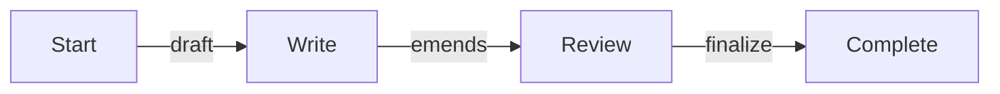
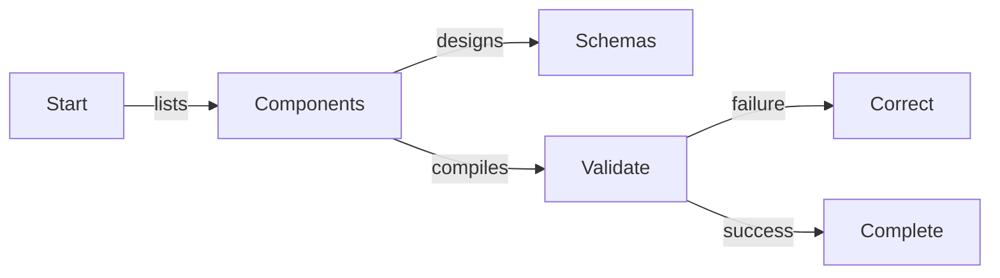
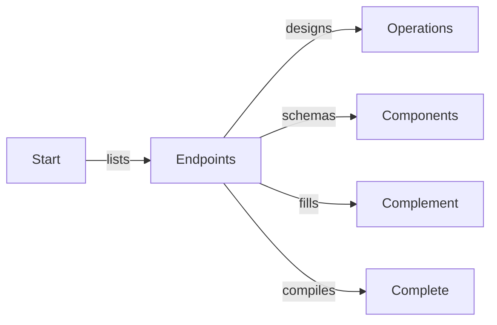

import { Tabs } from "nextra/components";

import RemoteSource from "../../../components/RemoteSource";

## Event Handling
<Tabs 
  items={[
    <code>src/main.ts</code>, 
    <code>AutoBeHistory</code>
  ]}>
  <Tabs.Tab>
```typescript filename="src/main.ts" showLineNumbers
```
  </Tabs.Tab>
  <Tabs.Tab>
    <RemoteSource
      url="https://raw.githubusercontent.com/wrtnlabs/autobe/refs/heads/main/packages/interface/src/events/AutoBeEvent.ts"
      filename="@autobe/interface"
      showLineNumbers
    />
  </Tabs.Tab>
</Tabs>

## Message Events
<Tabs items={[
  <code>AutoBeAssistantMessageEvent</code>,
  <code>AutoBeUserMessageEvent</code>,
  <code>AutoBeUserMessageContent</code>,
]}>
  <Tabs.Tab>
    <RemoteSource
      url="https://raw.githubusercontent.com/wrtnlabs/autobe/refs/heads/main/packages/interface/src/events/AutoBeAssistantMessageEvent.ts"
      filename="@autobe/interface"
      showLineNumbers>
    </RemoteSource>
  </Tabs.Tab>
  <Tabs.Tab>
    <RemoteSource
      url="https://raw.githubusercontent.com/wrtnlabs/autobe/refs/heads/main/packages/interface/src/events/AutoBeUserMessageEvent.ts"
      filename="@autobe/interface"
      showLineNumbers>
    </RemoteSource>
  </Tabs.Tab>
  <Tabs.Tab>
    <RemoteSource
      url="https://raw.githubusercontent.com/wrtnlabs/autobe/refs/heads/main/packages/interface/src/histories/contents/AutoBeUserMessageContent.ts"
      filename="@autobe/interface"
      showLineNumbers>
    </RemoteSource>
  </Tabs.Tab>
</Tabs>

## Analyze Events


## Prisma Events


## Interface Events


## Test Events


## Realize Events
Not yet implemented.