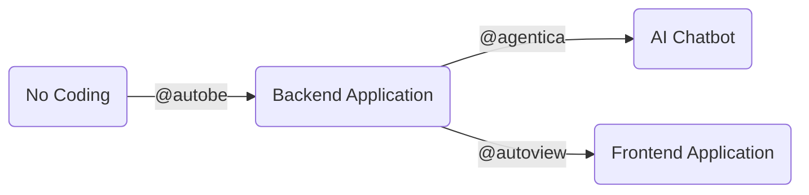

import AutoBeEcosystemAgenticaSnippet from "../../template/snippets/AutoBeEcosystemAgenticaSnippet.mdx";

## Full Stack No Coding



Our [WrtnLabs](https://github.com/wrtnlabs) team is developing two more projects, [`@agentica`](https://github.com/wrtnlabs/agentica) and [`@autoview`](https://github.com/wrtnlabs/autoview). [`@agentica`](https://github.com/wrtnlabs/agentica) automatically creates an AI Chatbot when you simply provide a `swagger.json` file, and [`@autoview`](https://github.com/wrtnlabs/autoview) automatically generates a Frontend Application when you provide a `swagger.json` file.

Therefore, you're not limited to automatically creating a backend with `@autobe` and no coding. If you've created a backend server with no coding through `@autobe`, you can immediately create an AI Chatbot and Frontend Application alongside it.

Can you converse? Then you're a full-stack developer.


## Agentica, AI Function Calling Framework


> `@autobe` is also developed using [`@agentica`](https://github.com/wrtnlabs/agentica)

https://github.com/wrtnlabs/agentica

Agentica is an Agentic AI framework specialized in AI Function Calling.

It does everything through function calling, and brings functions from the three protocols below. If you provide the `swagger.json` file of an `@autobe` generated backend server, it directly becomes an AI chatbot that interacts with it.

  - TypeScript Class/Interface
  - Swagger/OpenAPI Document
  - MCP (Model Context Protocol) Server

<AutoBeEcosystemAgenticaSnippet />


## AutoView, Type to React Component


https://github.com/wrtnlabs/autoview

AutoView is a frontend automation tool that generates React component code from type information from the sources below. If you provide the `swagger.json` file of an `@autobe` generated backend server, it directly becomes a frontend application.

  - TypeScript Type
  - JSON Schema (OpenAPI Document)

```typescript
import { AutoViewAgent } from "@autoview/agent";
import fs from "fs";
import OpenAI from "openai";
import typia, { tags } from "typia";

// 1. Define your own TypeScript interface to display
interface IMember {
  id: string & tags.Format<"uuid">;
  name: string;
  age: number & tags.Minimum<0> & tags.Maximum<100>;
  thumbnail: string & tags.Format<"uri"> & tags.ContentMediaType;
}

// 2. Setup the AutoView agent
const agent = new AutoViewAgent({
  model: "chatgpt",
  vendor: {
    api: new OpenAI({ apiKey: "********" }),
    model: "o3-mini",
    isThinkingEnabled: true,
  },
  input: {
    type: "json-schema",
    unit: typia.json.unit<IMember>(),
  },
  transformFunctionName: "transformMember",
  experimentalAllInOne: true, // recommended for faster and less-error results
});

// 3. Get the result!
const result = await agent.generate(); 
await fs.promises.writeFile(
  "./src/transformers/transformMember.ts",
  result.transformTsCode,
  "utf8",
);
```