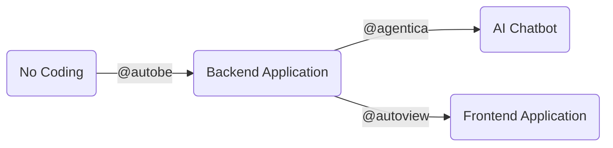

import AutoBePlaygroundSection from "../../template/AutoBePlaygroundSection.mdx";
import AutoBeRoadmapPreface from "../../template/AutoBeRoadmapPreface.mdx";
import AutoBeEcosystemAgenticaSnippet from "../../template/snippets/AutoBeEcosystemAgenticaSnippet.mdx";

## AutoBE, No Coding Agent for Backend Applications

{[
  [
    "Github License",
    "https://img.shields.io/badge/license-MIT-blue.svg",
    "https://github.com/wrtnlabs/autobe/blob/master/LICENSE"
  ],
  [
    "NPM Version",
    "https://img.shields.io/npm/v/@autobe/agent.svg",
    "https://www.npmjs.com/package/@autobe/agent"
  ],
  [
    "NPM Downloads",
    "https://img.shields.io/npm/dm/@autobe/agent.svg",
    "https://www.npmjs.com/package/@autobe/agent"
  ],
  [
    "Build Status",
    "https://github.com/wrtnlabs/autobe/workflows/build/badge.svg",
    "https://github.com/wrtnlabs/autobe/actions?query=workflow%3Abuild"
  ],
  [
    "Discord Badge",
    "https://dcbadge.limes.pink/api/server/https://discord.gg/aMhRmzkqCx?style=flat",
    "https://discord.gg/aMhRmzkqCx"
  ],
].map(([label, imgSrc, link]) => (
  
))}

{[
  [
    "Fuding Raising News",
    "https://wrtnlabs.io/agentica/images/badges/fund-raising-news-202503.svg",
    "https://www.bloomberg.com/news/videos/2025-03-31/wtrn-on-series-b-funding-growth-strategy-video"
  ],
  [
    "Open Source Mission",
    "https://wrtnlabs.io/agentica/images/badges/open-source-mission.svg",
    "https://github.com/wrtnlabs"
  ]
].map(([label, imgSrc, link]) => (
  
))}

Backend No Coding Agent, enhanced by Compiler and Validation Feedback.

`@autobe` is an AI agent for no coding that analyzes user requirements and automatically generates backend applications with the stack below. Since `@autobe` has been enhanced by TypeScript/Prisma compilers and OpenAPI validator feedback, it delivers 100% working code.

- TypeScript
- NestJS
- Prisma (Postgres)

## Playground
<AutoBePlaygroundSection />

## No Coding Ecosystem

Our [WrtnLabs](https://github.com/wrtnlabs) team is developing two more projects, [`@agentica`](https://github.com/wrtnlabs/agentica) and [`@autoview`](https://github.com/wrtnlabs/autoview). [`@agentica`](https://github.com/wrtnlabs/agentica) automatically creates an AI Chatbot when you simply provide a `swagger.json` file, and [`@autoview`](https://github.com/wrtnlabs/autoview) automatically generates a Frontend Application when you provide a `swagger.json` file.

Therefore, you're not limited to automatically creating a backend with `@autobe` and no coding. If you've created a backend server with no coding through `@autobe`, you can immediately create an AI Chatbot and Frontend Application alongside it.

Can you converse? Then you're a full-stack developer.

<AutoBeEcosystemAgenticaSnippet />

## Roadmap Schedule
<AutoBeRoadmapPreface />
