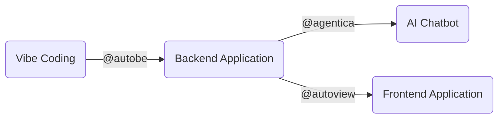

import AutoBePlaygroundSection from "../../template/AutoBePlaygroundSection.mdx";
import AutoBeRoadmapPreface from "../../template/AutoBeRoadmapPreface.mdx";

## AutoBE, Vibe Coding Agent for Backend Applications


<span style={{ display: "flex", flexDirection: "row" }}>
{[
  [
    "Github License",
    "https://img.shields.io/badge/license-MIT-blue.svg",
    "https://github.com/wrtnlabs/autobe/blob/master/LICENSE"
  ],
  [
    "NPM Version",
    "https://img.shields.io/npm/v/@autobe/agent.svg",
    "https://www.npmjs.com/package/@autobe/agent"
  ],
  [
    "NPM Downloads",
    "https://img.shields.io/npm/dm/@autobe/agent.svg",
    "https://www.npmjs.com/package/@autobe/agent"
  ],
  [
    "Build Status",
    "https://github.com/wrtnlabs/autobe/workflows/build/badge.svg",
    "https://github.com/wrtnlabs/autobe/actions?query=workflow%3Abuild"
  ],
  [
    "Discord Badge",
    "https://dcbadge.limes.pink/api/server/https://discord.gg/aMhRmzkqCx?style=flat",
    "https://discord.gg/aMhRmzkqCx"
  ],
].map(([label, imgSrc, link]) => (
  <a href={link} key={label} style={{ marginTop: "15px", marginRight: "5px" }}>
    
  </a>
))}
</span>

<span style={{ display: "flex", flexDirection: "row" }}>
{[
  [
    "Fuding Raising News",
    "https://wrtnlabs.io/agentica/images/badges/fund-raising-news-202503.svg",
    "https://www.bloomberg.com/news/videos/2025-03-31/wtrn-on-series-b-funding-growth-strategy-video"
  ],
  [
    "Open Source Mission",
    "https://wrtnlabs.io/agentica/images/badges/open-source-mission.svg",
    "https://github.com/wrtnlabs"
  ]
].map(([label, imgSrc, link]) => (
  <a href={link} key={label} style={{ marginTop: "15px", marginRight: "5px" }}>
    
  </a>
))}
</span>

Backend Vibe Coding Agent, enhanced by Compiler and Validation Feedback.

`@autobe` is an AI agent for vibe coding that analyzes user requirements and automatically generates backend applications with the stack below. Since `@autobe` has been enhanced by TypeScript/Prisma compilers and OpenAPI validator feedback, it delivers 100% working code.

- TypeScript
- NestJS
- Prisma (Postgres)

## Playground

<AutoBePlaygroundSection />

## Vibe Coding Ecosystem

### Full Stack Vibe Coding



Our [WrtnLabs](https://github.com/wrtnlabs) team is developing two more projects, [`@agentica`](https://github.com/wrtnlabs/agentica) and [`@autoview`](https://github.com/wrtnlabs/autoview). [`@agentica`](https://github.com/wrtnlabs/agentica) automatically creates an AI Chatbot when you simply provide a `swagger.json` file, and [`@autoview`](https://github.com/wrtnlabs/autoview) automatically generates a Frontend Application when you provide a `swagger.json` file.

Therefore, you're not limited to automatically creating a backend with `@autobe` and vibe coding. If you've created a backend server with vibe coding through `@autobe`, you can immediately create an AI Chatbot and Frontend Application alongside it.

Can you converse? Then you're a full-stack developer.

### Agentica, AI Function Calling Framework


> `@autobe` is also developed using [`@agentica`](https://github.com/wrtnlabs/agentica)

https://github.com/wrtnlabs/agentica

Agentica is an Agentic AI framework specialized in AI Function Calling.

It does everything through function calling, and brings functions from the three protocols below. If you provide the `swagger.json` file of an `@autobe` generated backend server, it directly becomes an AI chatbot that interacts with it.

  - TypeScript Class/Interface
  - Swagger/OpenAPI Document
  - MCP (Model Context Protocol) Server

```typescript
import { Agentica, assertHttpController } from "@agentica/core";
import OpenAI from "openai";
import typia from "typia";

import { MobileFileSystem } from "./services/MobileFileSystem";

const agent = new Agentica({
  vendor: {
    api: new OpenAI({ apiKey: "********" }),
    model: "gpt-4o-mini",
  },
  controllers: [
    // functions from TypeScript class
    typia.llm.controller<MobileFileSystem, "chatgpt">(
      "filesystem",
      MobileFileSystem(),
    ),
    // functions from Swagger/OpenAPI
    assertHttpController({
      name: "shopping",
      model: "chatgpt",
      document: await fetch(
        "https://shopping-be.wrtn.ai/editor/swagger.json",
      ).then(r => r.json()),
      connection: {
        host: "https://shopping-be.wrtn.ai",
        headers: { Authorization: "Bearer ********" },
      },
    }),
  ],
});
await agent.conversate("I wanna buy MacBook Pro");
```

### AutoView, Type to React Component


https://github.com/wrtnlabs/autoview

AutoView is a frontend automation tool that generates React component code from type information from the sources below. If you provide the `swagger.json` file of an `@autobe` generated backend server, it directly becomes a frontend application.

  - TypeScript Type
  - JSON Schema (OpenAPI Document)

```typescript
import { AutoViewAgent } from "@autoview/agent";
import fs from "fs";
import OpenAI from "openai";
import typia, { tags } from "typia";

// 1. Define your own TypeScript interface to display
interface IMember {
  id: string & tags.Format<"uuid">;
  name: string;
  age: number & tags.Minimum<0> & tags.Maximum<100>;
  thumbnail: string & tags.Format<"uri"> & tags.ContentMediaType;
}

// 2. Setup the AutoView agent
const agent = new AutoViewAgent({
  model: "chatgpt",
  vendor: {
    api: new OpenAI({ apiKey: "********" }),
    model: "o3-mini",
    isThinkingEnabled: true,
  },
  input: {
    type: "json-schema",
    unit: typia.json.unit<IMember>(),
  },
  transformFunctionName: "transformMember",
  experimentalAllInOne: true, // recommended for faster and less-error results
});

// 3. Get the result!
const result = await agent.generate(); 
await fs.promises.writeFile(
  "./src/transformers/transformMember.ts",
  result.transformTsCode,
  "utf8",
);
```

## Roadmap Schedule

<AutoBeRoadmapPreface />
