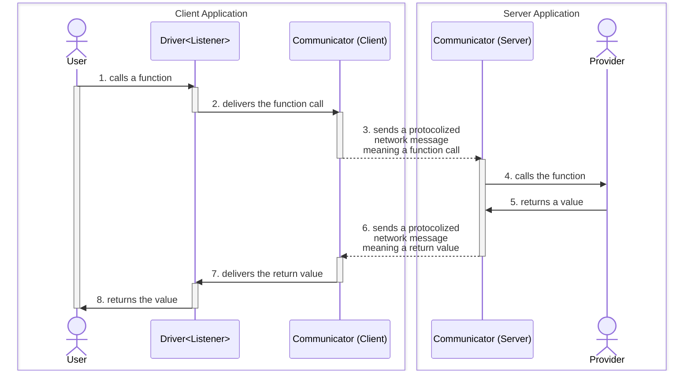

## `@autobe/rpc`

## Setup
### NestJS Server
### NodeJS Server
### Client Application

## Remote Procedure Call

WebSocket protocol with RPC paradigm for AI chatbot.

### Header
Header value delivered from client to server after the connection.

In [`TGrid`](https://tgrid.com)'s RPC (Remote Procedure Call) paradigm, header means a value that is delivered after the connection from a client to the server. And header is used in most cases to authenticate the connecting client.

In the above example project, `IAuthorizationHeader` is the header type, and is used by server to determine whether to accept the client's connection or not. If the client's header is not valid, the server would reject the connection.

### Provider
Functions provided from remote system.

Provider is an object instance containing some functions provided for the remote system for RPC (Remote Procedure Call). In many cases, the provide becomes a class instance containing some methods to be called, but it is okay that composing the provider by just an interface type.

Also, the opposite remote system will call provider's functions by the [`Driver<Remote>`](#driver) instance. In the above example, client application is providing `IAgenticaRpcListener` to the server, and server is providing `AgenticaRpcService` (`IAgenticaRpcService`) to the client.

### Driver
Driver of RPC (Remote Procedure Call).

`Driver` is a proxy instance designed to call functions of the remote system. It has a generic argument `Remote` which means the type of remote system's [Provider](#provider), and you can remotely call the functions of the [Provider](#provider) asynchronously through the `Drive<Remote>` instance.

When you call some function of remote [Provider](#provider) by the `Driver<Listener>` instance, it hooks the function call expression, and delivers the function name and arguments (parameter values) to the remote system through the [Communicator](#communicator). If the remote system succeeded to reply the result of the function call, [Communicator](#communicator) resolves the promise of the function call expression with the result, so that makes `Driver<Remote>` working.

In the above example, client application is calling `IAgenticaRpcService.conversate()` function remotely through the `Driver<IAgenticaRpcService>` typed instance. In that case, `IAgenticaRpcService` is the [Provider](#provider) instance from server to client.