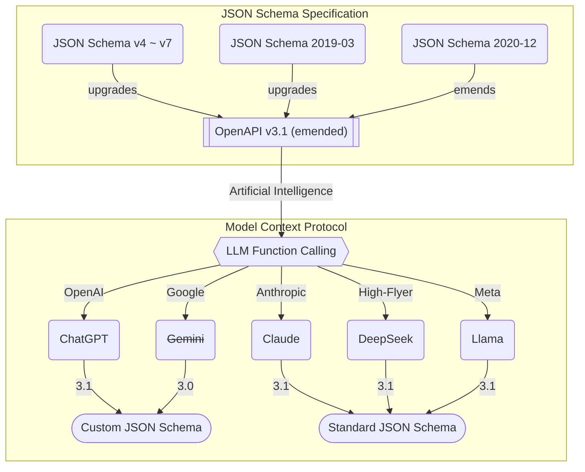

import { Tabs } from "nextra/components";

import LocalSource from "../../../components/LocalSource";

## Configuration
<LocalSource
  path="internals/website-examples/src/agent/main.config.ts"
  filename="main.config.ts"
  showLineNumbers />

When creating an `AutoBeAgent`, you can configure several properties that define how the agent operates and connects to LLM services.

The `model` property specifies the JSON schema model that corresponds to your chosen LLM vendor. Different vendors implement different schema specifications, so this setting must align with your selected provider. For OpenAI ChatGPT, you would use `"chatgpt"`, while Anthropic Claude requires `"claude"`, DeepSeek uses `"deepseek"`, and Meta Llama uses `"llama"`.

The `vendor` configuration defines your LLM service connection. The `api` property accepts an OpenAI SDK instance that handles the actual API communication, while the `model` property specifies the exact model name you want to use from that vendor. This flexible approach allows you to connect to various LLM providers beyond OpenAI by configuring the appropriate base URL and authentication.

The `config` section allows you to customize the agent's behavioral context. The `locale` setting determines the language and regional preferences that influence how the agent communicates, while `timezone` helps the agent understand geographical context when making decisions or generating responses that involve time-sensitive information.

Finally, the `compiler` property provides the necessary compilation tools for TypeScript, Prisma, and OpenAPI operations that the agent requires for code generation and analysis tasks.

## Vendor
<Tabs 
  items={["OpenAI", "Claude", "DeepSeek", "Meta Llama"]}
  defaultIndex={3}>
  <Tabs.Tab>
    <LocalSource
      path="internals/website-examples/src/agent/main.ts"
      filename="main.ts"
      showLineNumbers />
  </Tabs.Tab>
  <Tabs.Tab>
    <LocalSource
      path="internals/website-examples/src/agent/main.claude.ts"
      filename="main.claude.ts"
      showLineNumbers
      highlight="6-13" />
  </Tabs.Tab>
  <Tabs.Tab>
    <LocalSource
      path="internals/website-examples/src/agent/main.deepseek.ts"
      filename="main.deepseek.ts"
      showLineNumbers
      highlight="6-13" />
  </Tabs.Tab>
  <Tabs.Tab>
    <LocalSource
      path="internals/website-examples/src/agent/main.llama.ts"
      filename="main.llama.ts"
      showLineNumbers
      highlight="6-13" />
  </Tabs.Tab>
</Tabs>

When creating an `AutoBeAgent`, you can specify the LLM service vendor of your choice.

`AutoBeAgent` utilizes the OpenAI SDK (`npm i openai`) for LLM (Large Language Model) service interaction. However, this doesn't restrict you to using only OpenAI's GPT models. The OpenAI SDK serves as a connection tool to various LLM vendor APIs, and since most modern LLMs follow OpenAI's API design patterns, you can seamlessly integrate other LLM vendors such as Claude, DeepSeek, and others.

To use alternative vendors, configure the `AutoBeAgent.api.baseURL` and `AutoBeAgent.model` properties with the respective vendor's API endpoint and model name. For example, if you prefer Meta Llama over OpenAI GPT, you can configure it as shown above. Note that since LLM schema models differ between vendors, you must update the `IAgenticProps.model` property to match the vendor's schema model (e.g., `"llama"`).

- [`IChatGptSchema`](https://samchon.github.io/openapi/api/types/IChatGptSchema-1.html): OpenAI ChatGPT
- [`IClaudeSchema`](https://samchon.github.io/openapi/api/types/IClaudeSchema-1.html): Anthropic Claude
- [`IDeepSeekSchema`](https://samchon.github.io/openapi/api/types/IDeepSeekSchema-1.html): High-Flyer DeepSeek
- [`IGeminiSchema`](https://samchon.github.io/openapi/api/types/IGeminiSchema-1.html): Google Gemini
- [`ILlamaSchema`](https://samchon.github.io/openapi/api/types/ILlamaSchema-1.html): Meta Llama
- [`ILlmSchemaV3`](https://samchon.github.io/openapi/api/types/ILlmSchemaV3-1.html): middle layer based on OpenAPI v3.0 specification
- [`ILlmSchemaV3_1`](https://samchon.github.io/openapi/api/types/ILlmSchemaV3_1-1.html): middle layer based on OpenAPI v3.1 specification

JSON schema models vary between LLM vendors. When selecting a vendor model, exercise caution when determining the appropriate schema model for the `AutoBeAgent.model` property.

OpenAI and Google Gemini use proprietary JSON schema models rather than standard implementations. Google Gemini's JSON schema specification lacks support for reference types (`$ref`) and union types (`oneOf` or `anyOf`), which are essential for OpenAPI document composition. Consequently, Google Gemini is incompatible with `@autobe`.

Other LLM vendors like Claude, DeepSeek, and Meta Llama implement standard JSON schema models, making them fully compatible with `@autobe`. When using these vendors, you can configure the `AutoBeAgent.model` property with any desired value, including the `"chatgpt"` schema model.

However, this approach is not recommended because OpenAI's JSON schema specification restricts numerous features as listed below. Use the `"chatgpt"` schema model only when specifically using OpenAI as your LLM vendor.

**Restricted features in OpenAI's schema:**
- `IJsonSchema.INumber.minimum`
- `IJsonSchema.INumber.maximum`
- `IJsonSchema.INumber.exclusiveMinimum`
- `IJsonSchema.INumber.exclusiveMaximum`
- `IJsonSchema.INumber.multipleOf`
- `IJsonSchema.IString.minLength`
- `IJsonSchema.IString.maxLength`
- `IJsonSchema.IString.format`
- `IJsonSchema.IString.pattern`
- `IJsonSchema.IString.contentMediaType`
- `IJsonSchema.IArray.minItems`
- `IJsonSchema.IArray.maxItems`
- `IJsonSchema.IArray.uniqueItems`

## Locale and Timezone

<LocalSource
  path="internals/website-examples/src/agent/main.korea.ts"
  filename="main.korea.ts"
  showLineNumbers
  highlight="13-16" />

You can configure the `locale` and `timezone` properties to customize the AI agent's behavior.

These properties are transmitted to the AI agent, enabling it to consider the user's `locale` and `timezone` context. When you configure the locale property to `ko-KR`, the AI agent will communicate in Korean.

Similarly, when you set the `timezone` property to `Asia/Seoul`, the AI agent considers the geographic location and timezone, which can influence LLM function calling argument composition. For instance, if you ask the AI agent to "consider regulations," it will reference South Korean regulations.

## Compiler
<Tabs 
  items={["Embedding", "Separation", "Worker"]}
  defaultIndex={1}>
  <Tabs.Tab>
    <LocalSource
      path="internals/website-examples/src/agent/main.ts"
      filename="main.ts"
      showLineNumbers />
  </Tabs.Tab>
  <Tabs.Tab>
    <LocalSource
      path="internals/website-examples/src/agent/main.separate.ts"
      filename="main.separate.ts"
      showLineNumbers
      highlight="8-10, 18" />
  </Tabs.Tab>
  <Tabs.Tab>
    <LocalSource
      path="internals/website-examples/src/agent/compiler.worker.ts"
      filename="compiler.worker.ts"
      showLineNumbers />
  </Tabs.Tab>
</Tabs>

When creating an `AutoBeAgent`, you must provide a `compiler` instance. The `compiler` contains Prisma, OpenAPI, and TypeScript compilers. The simplest approach is to create a new instance of the `AutoBeCompiler` class.

However, since compiler operations are computationally intensive, if you're building a service application with `AutoBeAgent` that handles multiple connections from numerous users, the compiler can become a performance bottleneck. The `AutoBeAgent` server may experience blocking whenever the compiler is occupied with heavy tasks, such as generating Prisma schemas or TypeScript code.

In such scenarios, you can separate the compiler from the main agent and run it in a dedicated `worker` or `process`. Refer to the "Separation" and "Worker" tabs above, and follow the provided code snippets to separate the compiler from the main agent.