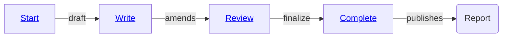
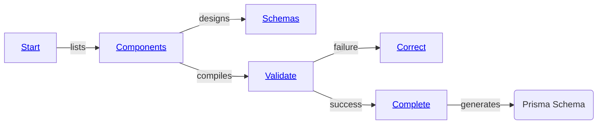
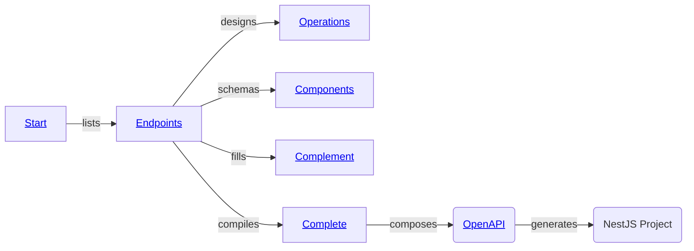
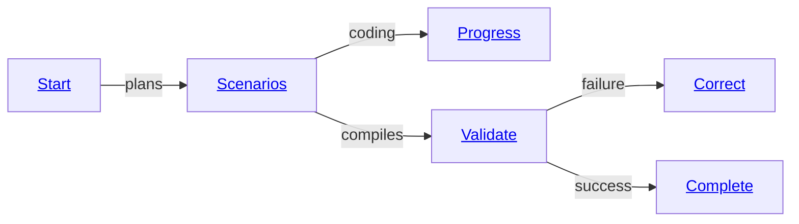

import { Tabs } from "nextra/components";

import LocalSource from "../../../components/LocalSource";
import LocalSourceGroup from "../../../components/LocalSourceGroup";
import RemoteSource from "../../../components/RemoteSource";

## Event Handling
<Tabs items={[
  <code>src/main.ts</code>, 
  <code>AutoBeEvent</code>
]}>
  <Tabs.Tab>
    <LocalSource
      path="internals/website-examples/src/agent/main.event.ts"
      filename="main.event.ts"
      showLineNumbers
      highlight="14-35" />
  </Tabs.Tab>
  <Tabs.Tab>
    <LocalSource
      path="packages/interface/src/events/AutoBeEvent.ts"
      filename="@autobe/interface"
      showLineNumbers
    />
  </Tabs.Tab>
</Tabs>

The `AutoBeAgent` provides real-time event notifications throughout the development process. 

These events allow you to monitor progress, handle intermediate states, and respond to completion events. All event types in `@autobe` are collected into the [`AutoBeEvent`](/api/types/_autobe_interface.AutoBeEvent-1.html) type as a union, providing comprehensive coverage of the agent's activities.

Events in AutoBE can be categorized into two main types:
- **Message Events**: Track conversation flow between user and assistant
- **Development Events**: Monitor progress through various development phases

## Message Events
<Tabs items={[
  <code>AutoBeUserMessageEvent</code>,
  <code>AutoBeAssistantMessageEvent</code>,
  <code>AutoBeUserMessageContent</code>,
]}>
  <Tabs.Tab>
    <LocalSource
      path="packages/interface/src/events/AutoBeUserMessageEvent.ts"
      filename="@autobe/interface"
      showLineNumbers />
  </Tabs.Tab>
  <Tabs.Tab>
    <LocalSource
      path="packages/interface/src/events/AutoBeAssistantMessageEvent.ts"
      filename="@autobe/interface"
      showLineNumbers />
  </Tabs.Tab>
  <Tabs.Tab>
    <LocalSourceGroup
      filename="@autobe/interface"
      showLineNumbers 
      paths={[
        "packages/interface/src/histories/contents/AutoBeUserMessageContent.ts",
        "packages/interface/src/histories/contents/AutoBeUserMessageAudioContent.ts",
        "packages/interface/src/histories/contents/AutoBeUserMessageFileContent.ts",
        "packages/interface/src/histories/contents/AutoBeUserMessageImageContent.ts",
        "packages/interface/src/histories/contents/AutoBeUserMessageTextContent.ts",
      ]}
    />
  </Tabs.Tab>
</Tabs>

Message events are fired whenever there's communication between the user and the assistant.

The [`AutoBeUserMessageEvent`](/api/interfaces/_autobe_interface.AutoBeUserMessageEvent.html) is triggered when users send messages. For users, multimodal capabilities are supported, allowing not only text but also image/document file attachments and voice input, which results in different content types. The [`AutoBeAssistantMessageEvent`](/api/interfaces/_autobe_interface.AutoBeAssistantMessageEvent.html) is fired when the assistant responds. The assistant communicates only through text, so its content type is limited to `string` in the `message` property.

These events are essential for building interactive interfaces, logging conversations, or implementing custom message processing logic.

## Development Events
### Analyze Events
<Tabs items={["start", "write", "review", "complete"]}>
  <Tabs.Tab>
    <LocalSource
      path="packages/interface/src/events/AutoBeAnalyzeStartEvent.ts"
      filename="@autobe/interface"
      showLineNumbers />
  </Tabs.Tab>
  <Tabs.Tab>
    <LocalSource
      path="packages/interface/src/events/AutoBeAnalyzeWriteEvent.ts"
      filename="@autobe/interface"
      showLineNumbers />
  </Tabs.Tab>
  <Tabs.Tab>
    <LocalSource
      path="packages/interface/src/events/AutoBeAnalyzeReviewEvent.ts"
      filename="@autobe/interface"
      showLineNumbers />
  </Tabs.Tab>
  <Tabs.Tab>
    <LocalSource
      path="packages/interface/src/events/AutoBeAnalyzeCompleteEvent.ts"
      filename="@autobe/interface"
      showLineNumbers />
  </Tabs.Tab>
</Tabs>

Analyze events track the requirements analysis process, which follows a structured workflow from initial drafting to final completion. 

The [`AutoBeAnalyzeStartEvent`](/autobe/api/interfaces/_autobe_interface.AutoBeAnalyzeStartEvent.html) event is fired when the agent begins drafting the requirements analysis. The [`AutoBeAnalyzeWriteEvent`](/autobe/api/interfaces/_autobe_interface.AutoBeAnalyzeWriteEvent.html) event occurs during the writing phase, followed by [`AutoBeAnalyzeReviewEvent`](/autobe/api/interfaces/_autobe_interface.AutoBeAnalyzeReviewEvent.html) during the review and amendment process. Finally, [`AutoBeAnalyzeCompleteEvent`](/autobe/api/interfaces/_autobe_interface.AutoBeAnalyzeCompleteEvent.html) is fired when the requirements analysis report is finalized.

[`AutoBeAnalyzeCompleteEvent`](/api/interfaces/_autobe_interface.AutoBeAnalyzeCompleteEvent.html) is generated when the `@autobe` agent and user have completed all discussions regarding requirements, and a report has been issued. The report consists of multiple markdown documents, which are stored in the `files` property.

The `step` property indicates which iteration of the requirements analysis report this represents. If this value is not 0, it means the requirements analysis report has been revised that many times. If the `step` value of other events is lower than [`AutoBeAnalyzeCompleteEvent.step`](/api/interfaces/_autobe_interface.AutoBeAnalyzeCompleteEvent.html#step), it means those events have not been reflected in the latest requirements analysis report.

### Prisma Events
<Tabs items={[
  "Prisma Events",
  <code>AutoBePrisma</code>,
  <code>IAutoBePrismaValidation</code>,
  <code>IAutoBePrismaCompileResult</code>,
]}>
  <Tabs.Tab>
    <LocalSourceGroup 
      filename="@autobe/interface"
      showLineNumbers
      paths={[
        "packages/interface/src/events/AutoBePrismaStartEvent.ts",
        "packages/interface/src/events/AutoBePrismaComponentsEvent.ts",
        "packages/interface/src/events/AutoBePrismaSchemasEvent.ts",
        "packages/interface/src/events/AutoBePrismaValidateEvent.ts",
        "packages/interface/src/events/AutoBePrismaCorrectEvent.ts",
        "packages/interface/src/events/AutoBePrismaCompleteEvent.ts"
      ]} 
    />
  </Tabs.Tab>
  <Tabs.Tab>
    <LocalSource
      path="packages/interface/src/prisma/AutoBePrisma.ts"
      filename="@autobe/interface"
      showLineNumbers />
  </Tabs.Tab>
  <Tabs.Tab>
    <LocalSource
      path="packages/interface/src/prisma/IAutoBePrismaValidation.ts"
      filename="@autobe/interface"
      showLineNumbers />
  </Tabs.Tab>
  <Tabs.Tab>
    <LocalSource
      path="packages/interface/src/compiler/IAutoBePrismaCompileResult.ts"
      filename="@autobe/interface"
      showLineNumbers />
  </Tabs.Tab>
</Tabs>

Prisma events monitor the database design process. Database design in `@autobe` begins with the [`AutoBePrismaStartEvent`](/api/interfaces/_autobe_interface.AutoBePrismaStartEvent.html), followed by [`AutoBePrismaComponentsEvent`](/api/interfaces/_autobe_interface.AutoBePrismaComponentsEvent.html) which lists all tables that `@autobe` will design and their categorized groups. The [`AutoBePrismaSchemasEvent`](/api/interfaces/_autobe_interface.AutoBePrismaSchemasEvent.html) event is fired each time tables within a category group are completed.

Once all schema designs are completed, the [`AutoBePrismaValidateEvent`](/api/interfaces/_autobe_interface.AutoBePrismaValidateEvent.html) event is triggered, and `@autobe`'s built-in Prisma compiler validates the table designs. If validation succeeds, `@autobe` fires the [`AutoBePrismaCompleteEvent`](/api/interfaces/_autobe_interface.AutoBePrismaCompleteEvent.html) event. Conversely, if validation fails, the [`AutoBePrismaCorrectEvent`](/api/interfaces/_autobe_interface.AutoBePrismaCorrectEvent.html) event is triggered, requesting the AI to fix the compilation errors. The [`AutoBePrismaValidateEvent`](/api/interfaces/_autobe_interface.AutoBePrismaValidateEvent.html) event is then fired again, repeating this cycle.

[`AutoBePrismaCompleteEvent`](/api/interfaces/_autobe_interface.AutoBePrismaCompleteEvent.html) is generated when `@autobe` analyzes the requirements specification and completes the database design.

`@autobe` constructs data of type [`AutoBePrisma.IApplication`](/api/interfaces/_autobe_interface.AutoBePrisma.IApplication.html) through AI function calling, validates it, and then generates prisma schema files. The validation results are stored in the `result` property as type [`IAutoBePrismaValidation`](/api/types/_autobe_interface.IAutoBePrismaValidation-1.html), and the results of converting this to prisma schema files (code generation) are stored in the `schemas` property.

Note that `@autobe` generally creates valid [`AutoBePrisma.IApplication`](/api/interfaces/_autobe_interface.AutoBePrisma.IApplication.html) data through a validation feedback process. However, when using very small AI models, the [`IAutoBePrismaValidation`](/api/types/_autobe_interface.IAutoBePrismaValidation-1.html) result might have `success := false`. Additionally, the results of compiling the prisma schema files are stored in the `compiled` property as type [`IAutoBePrismaCompileResult`](/api/types/_autobe_interface.IAutoBePrismaCompileResult-1.html), which should always compile successfully. If compilation fails, it would be a bug in `@autobe`, so please report it as an issue.

The `step` property indicates which requirements analysis report iteration the database design was performed for. If the [`AutoBePrismaCompleteEvent.step`](/api/interfaces/_autobe_interface.AutoBePrismaCompleteEvent.html#step) value is lower than [`AutoBeAnalyzeCompleteEvent.step`](/api/interfaces/_autobe_interface.AutoBeAnalyzeCompleteEvent.html#step), it means the database design has not yet been updated to reflect the latest requirements.

### Interface Events
<Tabs items={[
  "Interface Events",
  <code>AutoBeOpenApi</code>,
  <code>OpenApi</code>,
]}>
  <Tabs.Tab>
    <LocalSourceGroup 
      filename="@autobe/interface"
      showLineNumbers
      paths={[
        "packages/interface/src/events/AutoBeInterfaceStartEvent.ts",
        "packages/interface/src/events/AutoBeInterfaceEndpointsEvent.ts",
        "packages/interface/src/events/AutoBeInterfaceOperationsEvent.ts",
        "packages/interface/src/events/AutoBeInterfaceComponentsEvent.ts",
        "packages/interface/src/events/AutoBeInterfaceComplementEvent.ts",
        "packages/interface/src/events/AutoBeInterfaceCompleteEvent.ts"
      ]} 
    />
  </Tabs.Tab>
  <Tabs.Tab>
    <LocalSource
      path="packages/interface/src/openapi/AutoBeOpenApi.ts"
      filename="@autobe/interface"
      showLineNumbers />
  </Tabs.Tab>
  <Tabs.Tab>
    <RemoteSource
      url="https://raw.githubusercontent.com/samchon/openapi/refs/heads/master/src/OpenApi.ts"
      filename="@samchon/openapi"
      showLineNumbers />
  </Tabs.Tab>
</Tabs>

Interface events track the RESTful API design process. 

When `@autobe` designs RESTful APIs, it first fires the [`AutoBeInterfaceStartEvent`](/api/interfaces/_autobe_interface.AutoBeInterfaceStartEvent.html) event to signal the start of the interface agent. Then it triggers the [`AutoBeInterfaceEndpointsEvent`](/api/interfaces/_autobe_interface.AutoBeInterfaceEndpointsEvent.html) event to create the API endpoint list, followed by [`AutoBeInterfaceOperationsEvent`](/api/interfaces/_autobe_interface.AutoBeInterfaceOperationsEvent.html) which defines the role of each API function and [`AutoBeInterfaceComponentsEvent`](/api/interfaces/_autobe_interface.AutoBeInterfaceComponentsEvent.html) which defines the types they use. Additionally, the [`AutoBeInterfaceComplementEvent`](/api/interfaces/_autobe_interface.AutoBeInterfaceComplementEvent.html) event may be fired to supplement any missing types used in API operations or to provide necessary types as nested objects.

Finally, when all API design is complete, the [`AutoBeInterfaceCompleteEvent`](/api/interfaces/_autobe_interface.AutoBeInterfaceCompleteEvent.html) event is fired.

[`AutoBeInterfaceCompleteEvent`](/api/interfaces/_autobe_interface.AutoBeInterfaceCompleteEvent.html) is generated when the RESTful API design is completed based on the previous requirements analysis report and database design.

`@autobe` constructs data of type [`AutoBeOpenApi.IDocument`](/api/interfaces/_autobe_interface.AutoBeOpenApi.IDocument.html) through AI function calling, validates it, and stores it in the `document` property. This is then converted to a formal OpenAPI document ([OpenApi.IDocument](/api/interfaces/_samchon_openapi.OpenApi.IDocument-1.html)), and NestJS API controllers, DTOs, and e2e test code are generated (code generation), with the results stored in the `files` property.

The `step` property indicates which requirements analysis report iteration the API design was performed for. If the [`AutoBeInterfaceCompleteEvent.step`](/api/interfaces/_autobe_interface.AutoBeInterfaceCompleteEvent.html#step) value is lower than [`AutoBeAnalyzeCompleteEvent.step`](/api/interfaces/_autobe_interface.AutoBeAnalyzeCompleteEvent.html#step), it means the API design has not yet been updated to reflect the latest requirements.

### Test Events
<Tabs items={[
  "Test Events",
  <code>IAutoBeTypeScriptCompileResult</code>,
]}>
  <Tabs.Tab>
    <LocalSourceGroup 
      filename="@autobe/interface"
      showLineNumbers
      paths={[
        "packages/interface/src/events/AutoBeTestStartEvent.ts",
        "packages/interface/src/events/AutoBeTestScenarioEvent.ts",
        "packages/interface/src/events/AutoBeTestWriteEvent.ts",
        "packages/interface/src/events/AutoBeTestValidateEvent.ts",
        "packages/interface/src/events/AutoBeTestCorrectEvent.ts",
        "packages/interface/src/events/AutoBeTestCompleteEvent.ts"
      ]} 
    />
  </Tabs.Tab>
  <Tabs.Tab>
    <LocalSource
      path="packages/interface/src/compiler/IAutoBeTypeScriptCompileResult.ts"
      filename="@autobe/interface"
      showLineNumbers />
  </Tabs.Tab>
</Tabs>

Test events monitor the e2e test code generation process.

When `@autobe` writes e2e test code, it first fires the [`AutoBeTestStartEvent`](/api/interfaces/_autobe_interface.AutoBeTestStartEvent.html) event to signal the start of the test agent. Then it triggers the [`AutoBeTestScenarioEvent`](/api/interfaces/_autobe_interface.AutoBeTestScenarioEvent.html) event to create test scenarios. Subsequently, it writes each scenario in TypeScript code and fires [`AutoBeTestWriteEvent`](/api/interfaces/_autobe_interface.AutoBeTestWriteEvent.html) events to report the progress of test code writing.

Next, the [`AutoBeTestValidateEvent`](/api/interfaces/_autobe_interface.AutoBeTestValidateEvent.html) event is triggered to validate the written test code using the TypeScript compiler. If compilation fails, the [`AutoBeTestCorrectEvent`](/api/interfaces/_autobe_interface.AutoBeTestCorrectEvent.html) event is fired to provide feedback to the AI for fixing compilation errors. The [`AutoBeTestValidateEvent`](/api/interfaces/_autobe_interface.AutoBeTestValidateEvent.html) event is then triggered again, repeating this cycle.

Once all test code writing is complete, the [`AutoBeTestCompleteEvent`](/api/interfaces/_autobe_interface.AutoBeTestCompleteEvent.html) event is fired.

[`AutoBeTestCompleteEvent`](/api/interfaces/_autobe_interface.AutoBeTestCompleteEvent.html) is generated when e2e test code is written based on the previous requirements analysis, database design, and RESTful API specification.

`@autobe` conceives multiple use case scenarios for each API endpoint and implements them as test programs. These test programs are composed of one TypeScript file and a standalone function for each scenario, stored in the `files` property. These are then built using the TypeScript compiler embedded in `@autobe`, with the results stored in the `compiled` property.

When the AI occasionally writes incorrect TypeScript code, `@autobe` provides compilation error messages as feedback, allowing the AI to self-correct. This feedback process usually works correctly, so test code written by AI almost always compiles successfully. However, when using very small AI models, the [`IAutoBeTypeScriptCompileResult`](/api/types/_autobe_interface.IAutoBeTypeScriptCompileResult-1.html) result might have `success := false`.

The `step` property indicates which requirements analysis report iteration the test code was written for. If the [`AutoBeTestCompleteEvent.step`](/api/interfaces/_autobe_interface.AutoBeTestCompleteEvent.html#step) value is lower than [`AutoBeAnalyzeCompleteEvent.step`](/api/interfaces/_autobe_interface.AutoBeAnalyzeCompleteEvent.html#step), it means the test code has not yet been updated to reflect the latest requirements.

### Realize Events
Not implemented yet.