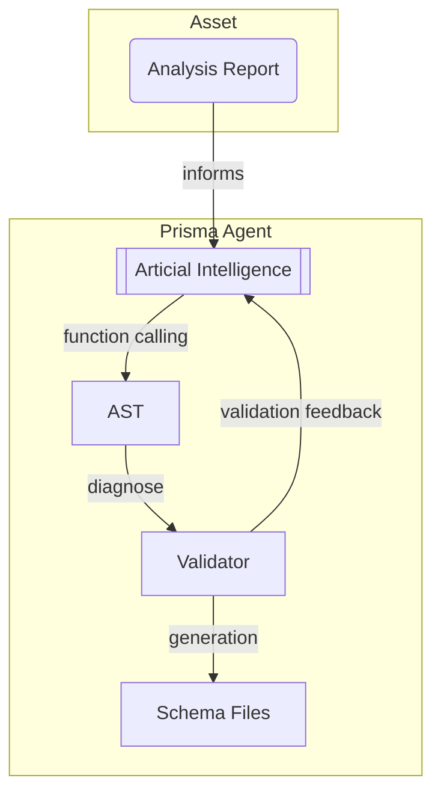
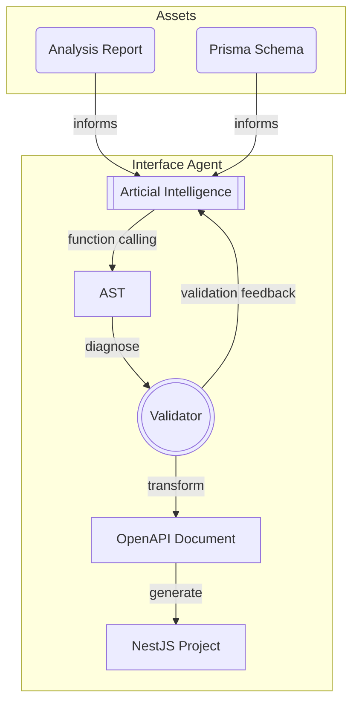
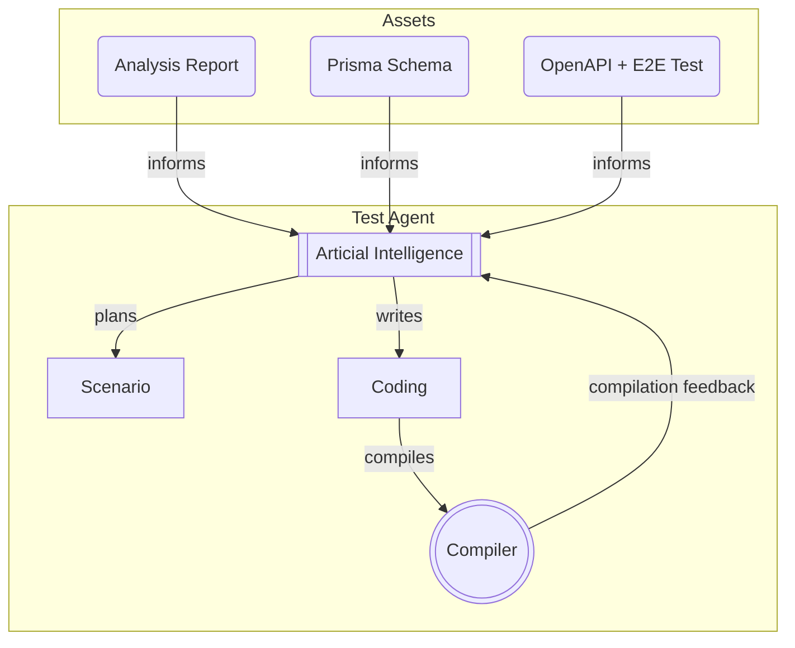
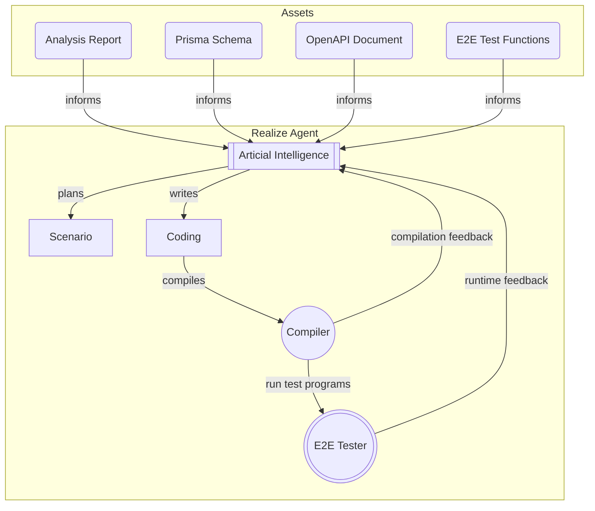

import { Tabs } from "nextra/components";

import AutoBeInterfaceShoppingControllerSnippet from "../../../template/snippets/AutoBeInterfaceShoppingControllerSnippet.mdx";
import AutoBeInterfaceShoppingDtoSnippet from "../../../template/snippets/AutoBeInterfaceShoppingDtoSnippet.mdx";
import AutoBeInterfaceShoppingTestSnippet from "../../../template/snippets/AutoBeInterfaceShoppingTestSnippet.mdx";
import AutoBeWaterfallDiagram from "../../../template/diagrams/AutoBeWaterfallDiagram.mdx";

## Outline
<AutoBeWaterfallDiagram />

`@autobe` is based on the waterfall model but incorporates the spiral model's iterative improvement cycles, producing high-quality code through continuous feedback between users and AI.

The spiral process ensures not only well-structured code but also safe and reliable implementations verified by integrated TypeScript/Prisma compilers, OpenAPI validator, and automated test programs at each development stage.

Waterfall    | AutoBE    | Description
-------------|-----------|----------------
Requirements | Analze    | Debate requirements with user.
Analysis     | Analze    | Write requirement analysis reports.
Design       | Prisma    | Write prisma schema (DB ORM) files and draw ERD.
Design       | Interface | Write OpenAPI document, convert it to a NestJS project.
Development  | Realize   | Write implementation code for each API endpoint.
Testing      | Test      | Write e2e test functions for each API endpoint.
Maintenance  | *         | Users can request AutoBE to modify the backend application.

## Analyze Agent
An agent that analyzes requirements and creates specification documents.

- **Input**: All conversation history between users and AI
- **Output**: Structured requirements specification
- **Features**: 
  - Separates business logic from technical requirements
  - Generates follow-up questions for ambiguous requirements
  - Establishes priorities and defines development scope

The Analyze agent serves as the foundation of the entire development process. It not only captures initial requirements but also continuously refines understanding through iterative conversation with users. When requirements are ambiguous or incomplete, it proactively formulates targeted questions to elicit necessary information before proceeding with development.

Additionally, once other agents have generated code, the Analyze agent can interpret change requests in the context of existing implementations, assessing the impact and feasibility of modifications while maintaining system integrity. This comprehensive approach ensures that all subsequent development stages work from a clear, complete, and consistent specification.

## Prisma Agent


An agent that generates database schemas through AutoBE's specialized AST-based approach.

- **Input**: Requirements specification
- **Output**: Prisma DB schema and ERD documentation
- **Features**:
  - No-code approach using [`AutoBePrisma.IApplication`](https://github.com/wrtnlabs/autobe/blob/main/packages/interface/src/prisma/AutoBePrisma.ts) AST structure
  - Built-in AutoBE Prisma compiler for validation and code generation
  - Automatic ERD documentation generation (using `prisma-markdown`)
  - Schema optimization through self-review system

The Prisma agent implements AutoBE's no-code methodology by working with structured data rather than text files. Instead of writing Prisma schema code directly, the AI constructs [`AutoBePrisma.IApplication`](https://github.com/wrtnlabs/autobe/blob/main/packages/interface/src/prisma/AutoBePrisma.ts) AST (Abstract Syntax Tree) data through function calling. This approach eliminates syntax errors and ensures consistency by operating at a higher abstraction level.

The workflow begins with analyzing the requirements specification to understand the data model needs. The AI then uses function calling to build the [`AutoBePrisma.IApplication`](https://github.com/wrtnlabs/autobe/blob/main/packages/interface/src/prisma/AutoBePrisma.ts) AST, which represents the complete database structure including entities, relationships, attributes, and constraints in a validated format.

AutoBE's built-in Prisma compiler validates this AST for correctness, consistency, and adherence to database design best practices. When validation errors occur, they're immediately fed back to the AI, enabling rapid iteration and refinement. This creates a feedback loop that continuously improves the schema design without manual debugging.

Once validation passes, the compiler automatically generates the actual Prisma schema files from the AST. The generated schemas include comprehensive documentation for each entity and attribute, explaining their business purpose and relationships. Finally, ERD documentation is produced using `prisma-markdown`, and the entire output undergoes quality review to ensure it meets project standards.

```prisma
/// Final component information on units for sale.
/// 
/// `shopping_sale_snapshot_unit_stocks` is a subsidiary entity of 
/// {@link shopping_sale_snapshot_units} that represents a product catalog 
/// for sale, and is a kind of final stock that is constructed by selecting 
/// all {@link shopping_sale_snapshot_unit_options options} 
/// (variable "select" type) and their 
/// {@link shopping_sale_snapshot_unit_option_candidates candidate} values in 
/// the belonging unit. It is the "good" itself that customers actually 
/// purchase.
/// 
/// - Product Name) MacBook
///   - Options
///   - CPU: { i3, i5, i7, i9 }
///   - RAM: { 8GB, 16GB, 32GB, 64GB, 96GB }
///   - SSD: { 256GB, 512GB, 1TB }
///   - Number of final stocks: 4 * 5 * 3 = 60
///
/// For reference, the total number of `shopping_sale_snapshot_unit_stocks` 
/// records in an attribution unit can be obtained using Cartesian Product. 
/// In other words, the value obtained by multiplying all the candidate 
/// values that each (variable "select" type) option can have by the number 
/// of cases is the total number of final stocks in the unit. 
///
/// Of course, without a single variable "select" type option, the final 
/// stocks count in the unit is only 1.
///
/// @namespace Sales
/// @erd Carts
model shopping_sale_snapshot_unit_stocks {
  /// Primary Key.
  ///
  /// @format uuid
  id String @id @db.Uuid

  /// Belonged unit's {@link shopping_sale_snapshot_units.id}
  ///
  /// @format uuid
  shopping_sale_snapshot_unit_id String @db.Uuid

  /// Name of the final stock.
  name String @db.VarChar

  /// Nominal price.
  ///
  /// This is not real price to pay, but just a nominal price to show.
  /// If this value is greater than the `real_price`, it would be shown
  /// like seller is giving a discount.
  ///
  /// @minimum 0
  nominal_price Float @db.DoublePrecision

  /// Real price to pay.
  ///
  /// @minimum 0
  real_price Float @db.DoublePrecision

  /// Initial inventory quantity.
  ///
  /// If this stock has been sold over this quantity count, the stock can't
  /// be sold anymore, because of out of stock. In that case, the seller can
  /// supplement the inventory quantity by registering some 
  /// {@link shopping_sale_snapshot_unit_stock_supplements} records.
  ///
  /// @minimum 0
  quantity Int

  /// Sequence order in belonged unit.
  sequence Int @db.Integer
}
```

## Interface Agent


An agent that designs API interfaces through AutoBE's specialized AST-based approach.

- **Input**: Requirements specification, ERD documentation
- **Output**:
  - OpenAPI Document generated from AST
  - Complete NestJS project with TypeScript code
    - TypeScript DTO types
    - NestJS Controllers
    - Client SDK Library
    - E2E Test Functions
- **Features**:
  - No-code approach using [`AutoBeOpenApi.IDocument`](https://github.com/wrtnlabs/autobe/blob/main/packages/interface/src/openapi/AutoBeOpenApi.ts) AST structure
  - Built-in AutoBE API design compiler for validation and transformation
  - Multi-stage transformation pipeline (AST → OpenAPI → NestJS)
  - Comprehensive API documentation generation

The Interface agent employs AutoBE's no-code methodology to create precise, validated API interfaces. Rather than writing OpenAPI documents or TypeScript code manually, the AI constructs [`AutoBeOpenApi.IDocument`](https://github.com/wrtnlabs/autobe/blob/main/packages/interface/src/openapi/AutoBeOpenApi.ts) AST structures through function calling - a specialized, streamlined format optimized for AutoBE's development workflow.

The process starts with comprehensive analysis of the requirements specification and ERD documentation to understand business needs and data relationships. Using function calling, the AI builds the [`AutoBeOpenApi.IDocument`](https://github.com/wrtnlabs/autobe/blob/main/packages/interface/src/openapi/AutoBeOpenApi.ts) AST that captures the complete API design including endpoints, request/response schemas, validation rules, and documentation.

This custom AST format provides a more constrained and validated structure compared to raw OpenAPI or TypeScript, helping maintain consistency and preventing design flaws that could arise from unrestricted flexibility. The structured approach ensures that all APIs follow established patterns and conventions.

AutoBE's built-in API design compiler validates the AST structure for correctness, consistency, and best practices. The validation covers HTTP method usage, naming conventions, status codes, and documentation completeness. Any validation errors trigger feedback to the AI for immediate correction, creating an iterative refinement process.

The transformation pipeline operates in two distinct stages. First, the [`AutoBeOpenApi.IDocument`](https://github.com/wrtnlabs/autobe/blob/main/packages/interface/src/openapi/AutoBeOpenApi.ts) AST is converted into a standard [`OpenApi.IDocument`](https://github.com/samchon/openapi/blob/master/src/OpenApi.ts) format that conforms to the official OpenAPI specification. This OpenAPI document undergoes additional specification-compliant validation. Second, the validated OpenAPI document feeds into AutoBE's code generation pipeline, producing the complete NestJS project including controllers, DTOs, client SDK library, and E2E test scaffolds.

Each generated interface includes comprehensive JSDoc documentation explaining its purpose, behavior, and relationships. An internal review process continuously validates the generated interfaces against the original requirements and data model, ensuring completeness and consistency throughout the development cycle.

<Tabs items={["API Controller", "DTO Type", "E2E Test Function"]}>
  <Tabs.Tab>
    <AutoBeInterfaceShoppingControllerSnippet />
  </Tabs.Tab>
  <Tabs.Tab>
    <AutoBeInterfaceShoppingDtoSnippet />
  </Tabs.Tab>
  <Tabs.Tab>
    <AutoBeInterfaceShoppingTestSnippet />
  </Tabs.Tab>
</Tabs>

## Test Agent


An agent that enhances and completes E2E test code for each API interface.

- **Input**: API interfaces, OpenAPI Schema, pre-generated E2E test scaffolds
- **Output**: Complete test code for each API function
- **Features**:
  - Enhancement of automatically generated test scaffolds
  - Dependency analysis for proper test sequencing
  - Complex scenario generation with business logic validation
  - Comprehensive test documentation
  - TypeScript compiler validation
  - Test coverage optimization

The Test agent builds sophisticated test suites from the foundation provided by the Interface agent's automatically generated E2E test scaffolds. When the Interface agent transforms [`AutoBeOpenApi.IDocument`](https://github.com/wrtnlabs/autobe/blob/main/packages/interface/src/openapi/AutoBeOpenApi.ts) AST into a NestJS project, it mechanically creates basic test function scaffolds for each API endpoint. The Test agent's role is transforming these skeletal structures into comprehensive, business-aware test suites.

Working with the pre-generated scaffolds alongside requirements specifications, ERD documentation, and API interfaces, the Test agent develops sophisticated test scenarios that validate individual endpoint functionality and business rule compliance. It analyzes cross-endpoint interactions to ensure comprehensive system validation.

A key capability is dependency analysis between API functions. When endpoints require preconditions established by other API calls, the agent structures integrated test scenarios with proper execution sequencing. This dependency-aware approach ensures tests reflect real-world usage patterns and catch integration issues.

The agent designs comprehensive test scenarios covering edge cases, error conditions, and complex business workflows. Each enhanced test includes detailed documentation explaining the test's purpose, prerequisites, expected outcomes, and relationship to business requirements, serving as both executable validation and living documentation.

Built-in TypeScript compiler validation provides immediate feedback on syntax and type correctness. Compilation errors trigger iterative refinement, creating a self-correcting development loop. An internal review process evaluates test coverage and quality, ensuring optimal validation thoroughness across the entire API surface.

```typescript filename="test/features/test_create_comment_on_article_with_special_characters.ts" showLineNumbers
import { TestValidator } from "@nestia/e2e";
import api from "@ORGANIZATION/PROJECT-api";
import { IBbsArticle } from "@ORGANIZATION/PROJECT-api/lib/structures/IBbsArticle";
import { IBbsArticleComment } from "@ORGANIZATION/PROJECT-api/lib/structures/IBbsArticleComment";
import typia from "typia";

export async function test_create_comment_on_article_with_special_characters(connection: api.IConnection): Promise<void> {
  // 1. Create an article to comment on
  const articleInput: IBbsArticle.ICreate = {
    writer: "employee_special",
    format: "txt",
    title: "Test Article for Special Comment",
    body: "This is a base article for comment posting.",
    files: [],
    password: "secure_pw1!"
  };
  const article = await api.functional.bbs.articles.post(connection, {
    body: articleInput,
  });
  typia.assert<IBbsArticle>(article);
  
  // 2. Post a comment with special characters, emojis, and multilingual text
  const specialCommentBody =
    "Greetings! 👋 こんにちは！💡 Ça va? Привет! مرحبا! 你好！ & <script>alert('XSS')</script> \n -- السلام عليكم -- 𝄞✨";

  const commentInput: IBbsArticleComment.ICreate = {
    writer: "employee_special",
    format: "txt",
    body: specialCommentBody,
    files: [],
    password: "special_comment_pw1@"
  };
  const comment = await api.functional.bbs.articles.comments.postByArticleid(connection, {
    articleId: article.id,
    body: commentInput,
  });
  typia.assert<IBbsArticleComment>(comment);
  
  // 3. Retrieve the comment and validate its content
  const commentId = comment.id;
  const readComment = await api.functional.bbs.articles.comments.getByArticleidAndId(connection, {
    articleId: article.id,
    id: commentId,
  });
  typia.assert<IBbsArticleComment>(readComment);
  TestValidator.equals("comment writer")(
    comment.writer
  )(readComment.writer);
  TestValidator.equals("special comment body")(
    comment.snapshots[0].body
  )(specialCommentBody);
  
  // 4. (Negative/robustness) Try posting an empty body (should be rejected or stored as empty)
  const invalidCommentInput: IBbsArticleComment.ICreate = {
    writer: "employee_special",
    format: "txt",
    body: "",
    files: [],
    password: "special_comment_pw2@"
  };
  await TestValidator.error("should reject empty body")(
    () => api.functional.bbs.articles.comments.postByArticleid(connection, {
      articleId: article.id,
      body: invalidCommentInput,
    })
  );
}
```

## Realize Agent


An agent that implements complete service logic for each API function.

- **Input**: Requirements specification, Prisma schema, API interfaces, enhanced test code
- **Output**: Complete service implementation code for each API endpoint
- **Features**:
  - Direct TypeScript implementation (traditional coding approach)
  - Dual feedback validation (compilation + runtime testing)
  - Business logic implementation with best practices
  - Database integration through Prisma
  - Comprehensive error handling and security

The Realize agent represents the culmination of the AutoBE development pipeline, synthesizing all previous agents' outputs to create fully functional service implementations. Unlike other agents that use AST-based no-code approaches, the Realize agent employs traditional coding methods to write actual TypeScript implementation code.

The implementation process begins with comprehensive analysis of all available artifacts. The requirements specification defines business logic requirements, the Prisma schema provides the data model, the OpenAPI document specifies API contracts, and the enhanced test code establishes validation criteria. This multi-source analysis ensures implementations satisfy all defined requirements and constraints.

The agent creates maintainable, efficient code that correctly implements business logic while following established best practices. Generated service providers handle database interactions through Prisma, implement security and validation checks, process business rules according to specifications, and ensure proper error handling and logging.

A robust dual-feedback validation system ensures high-quality output. The embedded TypeScript compiler provides immediate compilation feedback, catching syntax errors and type mismatches. More critically, implementation code undergoes continuous testing against the Test Agent's enhanced test suites, providing runtime validation of functional correctness and business logic compliance.

This compile-time and runtime validation creates a comprehensive quality assurance environment where errors are caught and corrected iteratively. An internal review process evaluates code quality, identifying optimization opportunities, performance improvements, and coding standard adherence. The result is implementation code that is functionally correct, maintainable, and performant.