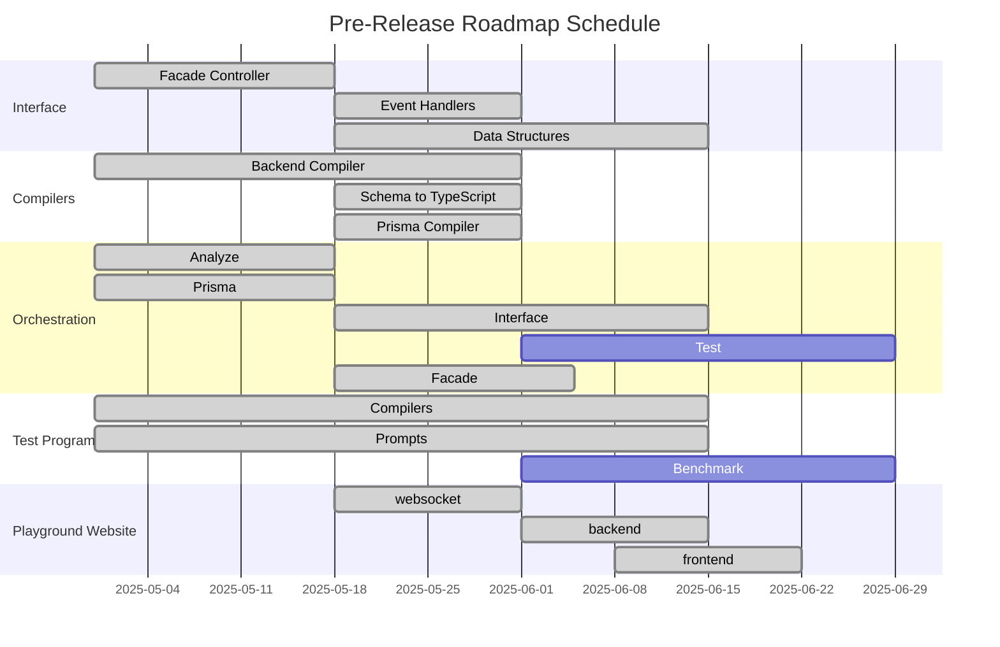

## Alpha Pre-Release

We are committed to delivering the best possible `@autobe` experience and have confirmed that all functional agents are operating correctly. Prior to our v1.0 official release, we plan to conduct two pre-release phases as outlined below.

However, these alpha and beta pre-releases will lack certain refinements. Streaming functionality will not be available, which means users may experience longer wait times during conversations with the `@autobe` agent while it completes program generation. Additionally, limited event granularity may make it difficult to track the intermediate progress of functional agents.

During this period, comprehensive documentation will not yet be available. Developers who wish to use `@autobe` at the library level may need to refer directly to API documentation, source code comments, or test programs to understand usage patterns.

All these limitations will be resolved in the v1.0 official release.

- Alpha version: 2025-06-01

## Official Release

We will create a comprehensive technical specification website to introduce `@autobe`'s concepts and usage. We'll provide detailed guidance on how to integrate [`@agentica`](https://github.com/wrtnlabs/agentica) with backend servers generated by `@autobe` to create AI chatbot applications, and how to leverage [`@autoview`](https://github.com/wrtnlabs/autoview) with `@autobe` generated servers to instantly build frontend and mobile applications.

Additionally, we will implement streaming processing for `@autobe` agents, allowing users to observe in real-time what the `@autobe` agent is thinking, planning, and creating. We will enhance and document the event API to provide convenience for developers using `@autobe` at the library level.

Once this comprehensive refinement work is completed, `@autobe` will be officially released as version 1.0. We appreciate your anticipation and support.

- Target Release: 2025-09-01

## Hosting Service

We will create an integrated `@autobe` hosting service. When you discuss requirements with the `@autobe` agent through chat, your application will be deployed to our server infrastructure and made available for immediate use.

This integrated hosting service will be connected with [`@agentica`](https://github.com/wrtnlabs/agentica) and [`@autoview`](https://github.com/wrtnlabs/autoview). Simply by discussing requirements with the AI agent, you can automatically generate and deploy not only backend servers but also AI chatbot applications and frontend/mobile applications, all ready for immediate testing and use.

While we cannot yet guarantee the exact launch date for our hosting service, Wrtn Technologies will demonstrate the future of vibe coding. We will show you not the current era's vibe coding where you might succeed once or twice out of 100 attempts and exclaim "wow" with excitement, but the future's vibe coding where 100 attempts yield 100 successes—truly reliable, production-ready automation.

- Target Release: 2025-12-01