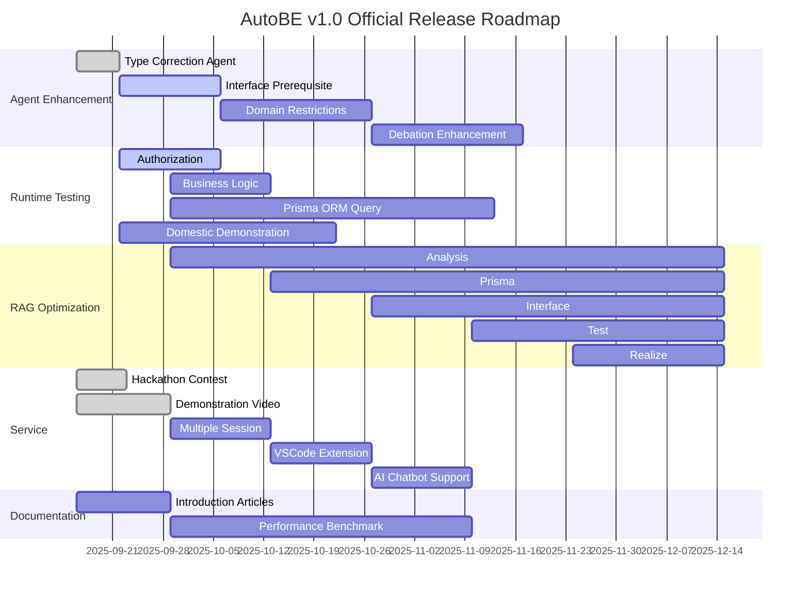

## Preface


## 1. Agent Enhancement
### 1.1. Type Correction Agent
We are introducing an independent correction agent specialized in TypeScript type casting and type assignment error resolution to dramatically improve compilation success rates.

AutoBE's Test and Realize Agents frequently generated various type casting errors during complex TypeScript code generation, including typia tag type mismatches, Date to string conversions, and nullable/undefined type assignments. The existing general-purpose compiler feedback system could not effectively resolve these specialized error patterns, and complex cross-type issues like `"typia.tag"` property mismatches were a persistent cause of compilation failures.

The AutoBE team has developed a Type Correction Agent that specializes exclusively in handling type casting errors. This agent implements expert resolution strategies for 12 major type error patterns, including `satisfies` operator patterns, precise distinction between `typia.assert` vs `typia.assertGuard`, and nullish coalescing handling.

**Key Achievement**: This mission is now complete, resulting in achieving **100% compilation success rate** not only with `openai/gpt-4.1` but also with lightweight models like `openai/gpt-4.1-mini` and `qwen3-next-80b-a3b` in the Beta release. This significantly improves AutoBE's accessibility, laying the foundation for more developers to leverage AI backend development cost-effectively.

### 1.2. Interface Prerequisite
We're building a prerequisite derivation system that clearly defines dependencies between API calls, simultaneously enhancing test quality and AI chatbot intelligence.

By adding the `AutoBeOpenApi.IOperation.prerequisites` property to the Interface Agent, we explicitly define other APIs that must be called before performing each API operation. For example, a "Create Order" API requires prerequisite API calls such as "User Authentication", "Inventory Check", and "Shipping Address Validation", and these dependency relationships are systematically documented.

**Core Applications**:

1. **Sophisticated E2E Test Scenarios**: The Test Agent accurately understands API call sequences to generate realistic test cases that reflect actual user flows. With clear prerequisites, test data preparation, state setup, and cleanup operations can be automated.

2. **AI Chatbot Intelligence Enhancement**: As described in [4.5. AI Chatbot Support](#45-ai-chatbot-support), when the AI chatbot processes user requests, it can automatically collect necessary information and call APIs in the correct sequence. For instance, when a user requests "cancel my order", the chatbot automatically follows the sequence: "User Authentication → Order Lookup → Cancellation Eligibility Check → Order Cancellation".

This feature goes beyond simple documentation to become the core infrastructure that can instantly transform AutoBE-generated backends into conversational interfaces.

### 1.3. Domain Restrictions
We're systematically managing domain-specific constraints and business rules to generate production-level backend applications.

Real business environments have unique constraints and rules for each domain. Examples include transaction limits in the financial domain, inventory management rules in e-commerce, and privacy requirements in healthcare systems. AutoBE is evolving to understand these domain-specific characteristics and automatically apply appropriate constraints.

**Implementation Details**:
- **Industry Templates**: Building a library of standard constraints for major industries including finance, healthcare, e-commerce, and education
- **Regulatory Compliance Automation**: Automatically applying regulatory requirements like GDPR, PCI-DSS, HIPAA at the code level
- **Business Rules Engine**: A system for declaratively defining and validating complex business logic
- **Domain Validation Framework**: Automatic verification that generated code complies with all domain constraints

Through this, AutoBE can generate production-ready backends that meet actual business requirements, beyond simple CRUD applications.

### 1.4. Debation Enhancement
We're implementing an intelligent conversation system that derives perfect backend specifications through in-depth requirements discussion with users.

The v1.0 release aims to accurately understand and implement concrete, complex requirements based on real business cases, rather than abstract requirements like "just handle it for me". To achieve this, AutoBE will have sophisticated debate capabilities to actively engage with users, discover hidden requirements, and clarify ambiguous aspects.

**Enhanced Conversation Capabilities**:
- **Context-Based Questioning**: Generating customized questions tailored to domain and project characteristics
- **Requirements Conflict Detection**: Identifying conflicting requirements and resolving them with users
- **Best Practice Suggestions**: Proposing industry standards and best practices for user requirements
- **Progressive Specification**: Converting abstract requirements into concrete specifications through step-by-step dialogue
- **Decision Recording**: Systematically documenting all design decisions and their rationale

Through these enhanced debate capabilities, AutoBE evolves beyond a simple code generation tool to become a true AI technology partner.

## 2. Runtime Testing


AutoBE achieved the groundbreaking milestone of **100% compilation success rate** in the Beta release. Now for v1.0 release, we're taking it a step further, aiming for **100% runtime success rate**, opening a new era where AI generates flawless backend applications ready for immediate deployment.

While compilation success ensures syntactic correctness, true value lies in code that operates stably in production environments. AutoBE v1.0 builds a system where AI autonomously verifies and guarantees all aspects of runtime quality including business logic accuracy, data integrity, performance optimization, and security enhancement.

### 2.1. Authorization
We're improving code generation to accurately implement authentication/authorization logic at runtime.

Correctly implementing JWT and Session-based authentication, and automatically generating basic permission management logic based on user roles. Implementing essential lifecycle management including token creation, renewal, and expiration to automatically create authentication systems that operate stably.

### 2.2. Business Logic
Generating runtime error-free logic by accurately implementing business rules.

**Core Improvements**:
- **Basic Transaction Processing**: Ensuring atomicity of database operations
- **Business Rule Implementation**: Accurately converting domain-specific business logic to code
- **Error Handling**: Appropriate handling of predictable exceptions
- **Data Validation**: Automatic generation of input data validation logic

AutoBE stably implements business logic specified in requirements.

### 2.3. Prisma ORM Query
Improving ORM query generation to accurately execute database queries at runtime.

Currently, AutoBE occasionally generates code that passes compilation but fails at runtime when generating Prisma ORM queries in complex DB designs. Issues particularly arise with multi-relation joins, circular references, and complex filtering conditions.

In v1.0, we're improving to accurately handle join queries and filtering logic, properly use basic aggregate functions, and maintain data consistency during transaction processing. Through this, we generate code that operates stably throughout the entire workflow from (analyze → prisma → interface → test → realize).

### 2.4. Domestic Demonstration
Wrtn Technologies validates practicality by applying AutoBE to their own service development.

To make AutoBE a tool usable in actual production environments, we're experimentally applying it to our own service development. While specific details cannot be disclosed, we plan to verify practical applicability by utilizing it for actual operational service development.

**Validation Goals**:
- **Practicality**: Generating backends that meet actual business requirements
- **Stability**: Generated code operating stably in production environments
- **Maintainability**: Developers can understand and modify AI-generated code
- **Development Speed**: Development time reduction compared to traditional development methods

Through this proof-of-concept project, we'll prove that AutoBE is a practical tool usable in real work environments.

## 3. Retrieval Augmented Generation


Transitioning to a next-generation architecture that maximizes token efficiency and improves generation quality through intelligent cyclic workflows.

Currently, each AutoBE agent operates with a single function call, receiving and processing all results from previous stages in bulk. For example, the Test Agent receives all documents generated by Analysis, Prisma, and Interface Agents at once, causing inefficiency where token consumption increases exponentially at each stage.

In v1.0, we're transitioning to an intelligent cyclic structure where each agent **selectively requests only necessary information**. Agents gradually collect information through multiple function calls and generate final outputs when sufficient context is secured.

**Revolutionary Improvement Effects**:
- **90% Token Consumption Reduction**: Eliminating unnecessary context through selective information loading
- **Improved Memory Efficiency**: Stable processing even in large-scale projects
- **Enhanced Accuracy**: More accurate code generation with focused context
- **Progressive Improvement**: Immediate reflection of feedback at each stage

```typescript
interface ITestWriteApplication {
  getDocuments(filenames: string[]): Record<string, string>;
  getModel(names: string[]): AutoBePrisma.IModel[]; 
  getOperation(endpoints: AutoBeOpenApi.IEndpoint[]): {
    operations: AutoBeOpenApi.IOperation[];
    schemas: Record<string, AutoBeOpenApi.IJsonSchemaDescriptive>;
  };
  complete(file: IAutoBeTestFunction): void;
  halt(reason: string): void;
}
```

This cyclic workflow evolves AutoBE into a smarter and more efficient system, enabling cost-effective operation even in large-scale enterprise projects.

## 4. Service
### 4.1. Hackathon Contest
Following the beta release, we're hosting a hackathon to validate AutoBE in practice and collect community feedback.

The first AutoBE hackathon runs from September 12-14, 2025. 40 skilled backend developers will participate to evaluate AutoBE's code generation capabilities. Participants will use `openai/gpt-4.1-mini` and `openai/gpt-4.1` models to generate actual backend applications, validating the entire process from requirements analysis to implementation code.

**Expected Outcomes**:
- Running a contest with total prizes of $6,400
- Securing diverse technical reviews
- Collecting practitioner feedback on production readiness
- Deriving insights on AutoBE's strengths and areas for improvement

Participant feedback: https://github.com/wrtnlabs/autobe/discussions/categories/hackathon-2025-09-12

### 4.2. Demonstration Video
We're creating a demo video that visually showcases the full-stack development process combining AutoBE and AutoView.

By integrating AutoBE's backend generation capabilities with AutoView's frontend automation, we'll demonstrate AI building a complete web application from start to finish. The video will capture the process of implementing a community platform like Reddit in just a few hours.

**Demo Content**:
- Backend construction from natural language requirements alone
- Frontend generation based on Swagger documentation
- Database schema design and API implementation process
- Completing an executable application

Demo Video:

<br/>
<iframe
  src="https://www.youtube.com/embed/iE0b3Gt_uPk"
  title="Demo AutoBE & AutoView : Full-Stack development of a Reddit-like App"
  width="100%"
  style={{ aspectRatio: "16/9" }}
  allow="accelerometer; autoplay; clipboard-write; encrypted-media; gyroscope; picture-in-picture; web-share"
  referrerPolicy="strict-origin-when-cross-origin"
  allowFullScreen
></iframe>

### 4.3. Multiple Session


Adding multi-session management functionality to the local playground for efficient management of multiple projects.

The current AutoBE playground only supports single sessions, with the limitation that previous conversations disappear when starting new projects. In v1.0, we're applying the multi-session interface implemented in the hackathon service to local environments, allowing developers to work on multiple projects simultaneously and return to previous conversations at any time.

**Technical Differences**:
- **Hackathon Service**: Multi-user session management in PostgreSQL-based cloud environment
- **Local Playground**: Lightweight local session management system based on SQLite

**Key Features**:
- Maintaining independent conversation history per project
- Quick switching and search between sessions
- Export/import conversation content
- Save and reuse project templates

### 4.4. VSCode Extension
Launching an extension that allows developers to use AutoBE directly in their most familiar environment: VSCode.

Currently, using AutoBE requires the cumbersome process of cloning the repository and installing dependencies. In v1.0, we're providing a one-click installable extension from the VSCode Marketplace, enabling developers to immediately start AI backend development in their familiar IDE environment.

**Core Features**:
- **Integrated Development Environment**: Direct use of AutoBE chat interface within VSCode
- **Real-time Code Generation**: Generated code immediately reflects in the editor for instant editing
- **IntelliSense Support**: Auto-completion and documentation for generated APIs and data models
- **Debugging Integration**: Immediately debug generated backend code with VSCode debugger
- **Git Integration**: Automated change tracking and version control

Through this, AutoBE naturally integrates into developers' daily workflows, making AI-assisted development not a special tool but a routine development practice.

### 4.5. AI Chatbot Support
Instantly transform AutoBE-generated backends into conversational AI chatbots, allowing perfect experience and validation of API functionality without technical knowledge.

Backend applications generated by AutoBE include hundreds of API endpoints and complex data models, making it difficult to grasp the entire structure. Especially for business managers or planners unfamiliar with programming, it's hard to verify whether the generated backend properly implements their requirements.

v1.0 innovatively solves this problem through **automatic AI chatbot conversion**. It analyzes the generated backend API and automatically creates an intelligent chatbot that can use all functions in natural language.

**Real-World Usage Scenario**:
The video below shows a real case of converting an AutoBE-generated shopping mall backend into a chatbot. Users can use all functions of the complex e-commerce system through natural conversations like "search for products", "add to cart", "place an order".

**Tasks the Chatbot Automatically Handles**:
- Automatic API call sequence determination (utilizing prerequisites)
- Conversationally collecting necessary parameters
- Step-by-step guidance through complex workflows
- Friendly explanations and alternatives when errors occur
- Displaying execution results in an easy-to-understand format

This presents a new paradigm: **"Verify while conversing"** instead of **"Try it out since it's built"**.

<br/>
<iframe
  src="https://www.youtube.com/embed/RAzYo02HTXA"
  title="Demo AutoBE & AutoView : Full-Stack development of a Reddit-like App"
  width="100%"
  style={{ aspectRatio: "16/9" }}
  allow="accelerometer; autoplay; clipboard-write; encrypted-media; gyroscope; picture-in-picture; web-share"
  referrerPolicy="strict-origin-when-cross-origin"
  allowFullScreen
></iframe>

## 5. Documentation
### 5.1. Introduction Articles
Spreading AutoBE to the global developer community through strategic content marketing.

Building on the successful documentation strategy of the beta release, v1.0 will produce more systematic and comprehensive technical content for distribution to major developer communities and platforms.

**Content Strategy**:
- **Technical Deep Dive Series**: Detailed explanations of core technologies including AutoBE architecture, compiler strategy, AI Function Calling
- **Success Case Studies**: Real enterprise project cases using AutoBE and ROI analysis
- **Tutorial Series**: Step-by-step learning materials from beginner to advanced
- **Comparative Analysis**: Quantitative analysis of AutoBE's advantages over traditional development methods

**Distribution Channels**:
- Major technical blog platforms like Medium, Dev.to, Hacker News
- Developer communities like Reddit, Stack Overflow
- Live coding sessions through video platforms like YouTube, Twitch
- Presentations and workshops at major tech conferences

### 5.2. Performance Benchmark
Establishing new benchmark standards for AI Function Calling-based code generation and systematically evaluating major AI model performance.

AutoBE's innovation lies in AI **directly constructing AST (Abstract Syntax Tree) structures through Function Calling** rather than writing code as text. This means completely different evaluation criteria are needed compared to existing code generation benchmarks.

**AutoBE-Specific Benchmark Framework**:
- **Function Calling Accuracy**: Accurate execution rate of complex nested function calls
- **AST Structure Completeness**: Syntactic/semantic accuracy of generated syntax trees
- **Context Consistency**: Ability to maintain context across multi-stage workflows
- **Domain Understanding**: Accuracy of converting business requirements to code
- **Compilation Success Rate**: Ratio of immediately buildable generated code
- **Runtime Stability**: Error rate in actual execution environments

**Models Under Evaluation**:
- **OpenAI**: GPT-4.1, GPT-4.1-mini, GPT-5 (upcoming)
- **Anthropic**: Claude 4 series
- **Open Source**: Qwen3-next-80b-a3b, Llama 3.1, Mistral Large
- **New Models**: Monthly evaluation of new models

**Public Benchmark Leaderboard**:
With the v1.0 release, we'll publish a **monthly AutoBE Benchmark Report**. We'll evaluate each model's performance across 10 categories and 100 test scenarios, publishing rankings. This will provide objective metrics for developers to select the optimal AI model for their project characteristics.

Through cost-performance analysis, we'll provide guidance for startups to choose economical models and enterprises to select highest-performance models. This benchmark will establish itself as the new industry standard in AI code generation.