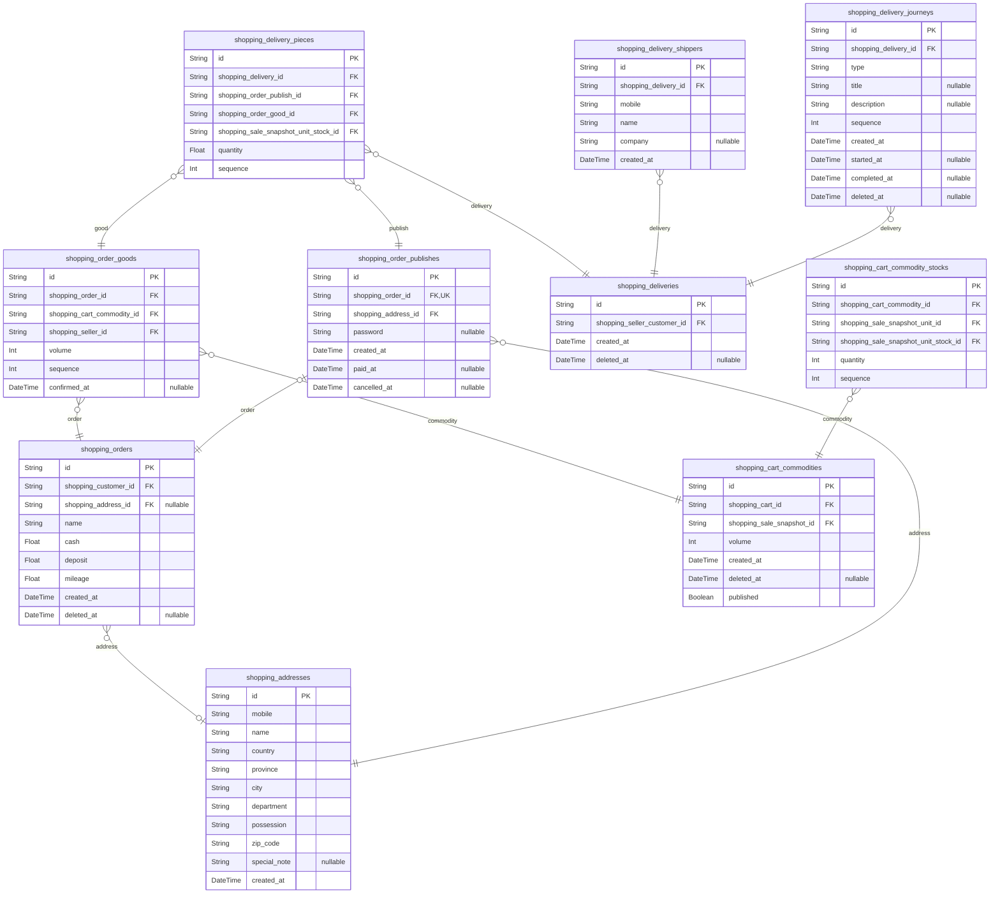

## Outline


Prisma ORM stands as the database layer of choice for `@autobe`, providing a perfect balance of clarity, type safety, and AI-friendliness that aligns seamlessly with our no-code vision.

The decision to adopt Prisma stems from its unique characteristics that make it exceptionally suitable for AI-driven development. Its clear schema definition language, automatic ERD generation capabilities, compile-time type safety, and predictable performance through application-level joins create an ideal environment where AI agents can reliably generate and validate database operations.

These features collectively ensure that `@autobe` can maintain high code quality and stability while enabling users to build sophisticated backend applications through natural conversation.

## Clear Definition

```prisma showLineNumbers filename="prisma/schema.prisma"
/// Supertype for the applicable conditions of the discount coupon.
/// 
/// `shopping_coupon_criterias` is a supertype entity that embodies the 
/// conditions for applying a {@link shopping_coupons discount coupon}. All 
/// subtype entities that wish to impose constraints on the reference unit of 
/// a discount coupon were created by inheriting this. For example, the 
/// {@link shopping_coupon_section_criterias} entity, designed to limit 
/// application to a specific {@link shopping_sections section}, inherits this 
/// entity `shopping_coupon_criterias`.
/// 
/// In addition, constraints on reference units can be specified through the 
/// `direction` property to proceed as an inclusion condition or, conversely, 
/// as an exclusion condition. If the direction value is "include", the coupon 
/// is applicable only to the reference object. Conversely, if the direction 
/// value is "exclude", it is a coupon that cannot be applied to the reference 
/// object.
/// 
/// @namespace Coupons
/// @author Samchon
model shopping_coupon_criterias {
  /// Primary Key.
  id String @id @db.Uuid

  /// Belonged coupon's {@link shopping_coupons.id}
  shopping_coupon_id String @db.Uuid

  /// Type of criteria.
  ///
  /// It means which subtype being used.
  type String @db.VarChar

  /// Direction of criteria.
  ///
  /// - include
  /// - exclude
  direction String @db.VarChar

  /// Sequence order in belonged coupon.
  sequence Int @db.Integer

  //----
  // RELATIONS
  //----
  /// Belonged coupon.
  coupon shopping_coupons @relation(fields: [shopping_coupon_id], references: [id], onDelete: Cascade)

  of_section shopping_coupon_section_criterias?
  of_sale    shopping_coupon_sale_criterias?
  of_funnel  shopping_coupon_funnel_criterias?
  of_seller  shopping_coupon_seller_criterias?

  @@index([shopping_coupon_id])
}
```

Prisma employs its own Data Definition Language (DDL) for defining database schema structures, which bears remarkable similarity to traditional SQL while offering enhanced clarity and expressiveness. This design choice provides the most intuitive and unambiguous schema definition experience among all ORMs, a quality that extends equally to both human developers and AI agents.

The Prisma schema syntax reads almost like natural language, making relationships, constraints, and data types immediately apparent. For instance, defining a one-to-many relationship is as straightforward as adding a relation field with clear directives. This clarity is crucial for AI comprehension - when an AI agent reads a Prisma schema, it can instantly understand the data model's structure, relationships, and constraints without ambiguity or complex interpretation layers.

Unlike traditional ORMs that often abstract database concepts behind programming language constructs or use verbose configuration objects, Prisma's schema-first approach maintains a direct correspondence with database concepts while remaining highly readable. This directness significantly reduces the cognitive load on AI systems, enabling them to generate accurate database schemas, understand existing structures, and make appropriate modifications with minimal risk of misinterpretation.

The schema's declarative nature also provides clear boundaries and constraints that guide AI behavior. When `@autobe` generates database schemas, the AI can leverage Prisma's well-defined syntax rules to ensure valid output, making the difference between successful code generation and compilation errors immediately apparent through the schema language's strict but intuitive structure.

## Entity Relationship Diagram



Prisma schemas can be automatically transformed into Entity Relationship Diagrams (ERDs) through the [`prisma-markdown`](https://github.com/samchon/prisma-markdown) third-party library, providing a visual representation that significantly enhances AI comprehension of database structures.

This automatic ERD generation capability serves as a crucial bridge between abstract schema definitions and visual understanding. When `@autobe` processes database schemas, it can leverage these diagrams to provide AI agents with multiple perspectives on the data model - both the textual schema definition and its visual representation. This dual approach dramatically improves the AI's ability to understand complex relationships, identify patterns, and make informed decisions about schema modifications.

The ERDs generated from Prisma schemas maintain perfect fidelity with the underlying data model, ensuring that AI agents always work with accurate representations. This consistency is vital for AI-driven development, where misunderstandings about data relationships can cascade into significant application errors. By providing clear visual feedback about table relationships, cardinalities, and constraints, these diagrams enable AI to reason about data flows, validate proposed changes, and suggest optimal schema designs.

Furthermore, the availability of ERDs enhances the AI's ability to communicate with human users. When `@autobe` needs to explain database structures or propose schema changes, it can reference these visual representations, making complex database concepts accessible to non-technical users and ensuring that the no-code development process remains truly inclusive.

## Strict Type Checking

```typescript filename="@samchon/shopping-backend" showLineNumbers
export namespace ShoppingSaleSnapshotProvider {
  export namespace json {
    export const transform = async (
      input: Prisma.shopping_sale_snapshotsGetPayload<
        ReturnType<typeof json.select>
      >,
    ): Promise<Omit<IShoppingSaleSnapshot, "latest">> => {
      if (input.content === null)
        throw ErrorProvider.internal(
          "No shopping_sale_snapshot_contents record exists.",
        );
      return {
        id: input.shopping_sale_id,
        snapshot_id: input.id,
        categories: await ArrayUtil.asyncMap(
          input.to_categories.sort((a, b) => a.sequence - b.sequence),
        )(ShoppingSaleSnapshotCategoryProvider.json.transform),
        units: input.units
          .sort((a, b) => a.sequence - b.sequence)
          .map(ShoppingSaleSnapshotUnitProvider.json.transform),
        content: ShoppingSaleSnapshotContentProvider.json.transform(
          input.content,
        ),
        tags: input.tags
          .sort((a, b) => a.sequence - b.sequence)
          .map((tag) => tag.value),
      };
    };
    export const select = () =>
      ({
        include: {
          units: ShoppingSaleSnapshotUnitProvider.json.select(),
          content: ShoppingSaleSnapshotContentProvider.json.select(),
          to_categories: {
            select: {
              category: {
                select: {
                  id: true,
                  shopping_channel_id: true,
                },
              },
              sequence: true,
            },
          },
          tags: true,
        },
      }) satisfies Prisma.shopping_sale_snapshotsFindManyArgs;
  }
}
```

When a Prisma schema is defined, the Prisma compiler automatically generates corresponding TypeScript types that encompass not only the data models but also their relationships and query builders. This comprehensive type generation enables TypeScript's compiler to catch all forms of invalid queries at compile time, standing in stark contrast to conventional ORM libraries that can only detect query errors at runtime.

This compile-time error detection is absolutely critical for AI-based no-code agents. As outlined in our TypeScript documentation, AI-generated code often contains subtle errors that would be difficult to detect through manual review. With Prisma's type-safe query builders, these issues are caught immediately during the code generation process. When `@autobe` generates database queries, TypeScript's compiler validates every aspect - from field names and types to relationship traversals and filtering conditions.

The tight integration between Prisma and TypeScript creates a powerful feedback loop for AI improvement. When the AI generates an invalid query, the TypeScript compiler provides precise error messages indicating exactly what went wrong - whether it's accessing a non-existent field, using an incorrect filter operator, or attempting an invalid relationship traversal. These compiler errors serve as immediate, actionable feedback that `@autobe` uses to refine its code generation, iterating until all type checks pass.

This approach fundamentally differs from runtime validation. With runtime-only error detection, AI agents would need to generate code, deploy it, execute various test scenarios, and then interpret runtime errors - a process that's both time-consuming and prone to missing edge cases. Prisma's compile-time validation eliminates this entire category of problems, enabling `@autobe` to guarantee database operation correctness before any code execution, dramatically improving both development speed and reliability.

## Application Joining

Prisma implements application-level joins, a sophisticated approach where related records are assembled not through database JOIN queries, but via manual application code using hash maps with primary and foreign key values. This fundamental architectural decision brings remarkable performance benefits and predictability that are essential for AI-generated applications.

The performance advantages of application joins over database joins are striking. According to real-world measurements, when dealing with complex relationships, database joins can process millions of redundant record combinations while application joins handle only the necessary unique records. For example, in a scenario involving multiple table relationships, a database join might process 2,258,000 record combinations taking 8.075 seconds, while the equivalent application join processes just 165 unique records in 0.00262 seconds - over 3,000 times faster.

This dramatic performance difference stems from how each approach handles data. Database joins create Cartesian products of tables, potentially generating massive intermediate result sets that must be filtered and deduplicated. The processing time and resource consumption grow exponentially with relationship complexity. In contrast, application joins fetch each table's data separately with simple, optimized queries, then use efficient in-memory hash map lookups to connect related records.

For AI-driven no-code development, the predictability of application joins is even more valuable than their performance benefits. Database join performance varies wildly based on numerous factors: data distribution, available indexes, table statistics, join order selected by the query optimizer, and current system load. What performs adequately in development might fail catastrophically in production when data patterns change. This unpredictability makes it nearly impossible for AI agents to generate reliably performant database operations.

Application joins eliminate this uncertainty entirely. Each component query is straightforward - selecting from a single table with simple WHERE clauses. The joining logic in the application layer uses hash maps, which provide consistent O(1) lookup performance regardless of data size. This approach trades theoretical maximum performance for absolute consistency and reliability. While a perfectly optimized SQL join might occasionally outperform application joins in specific scenarios, it requires expert tuning and continuous monitoring - capabilities beyond the scope of AI-generated code.

The implementation safety provided by Prisma's application joins is also noteworthy. When building application-level joins, Prisma analyzes entity relationships at compile time, providing IDE hints through auto-completion and detecting mistakes before runtime. This safety net ensures that `@autobe` generates correct joining logic, maintaining data integrity while delivering predictable performance across all deployments and usage patterns.