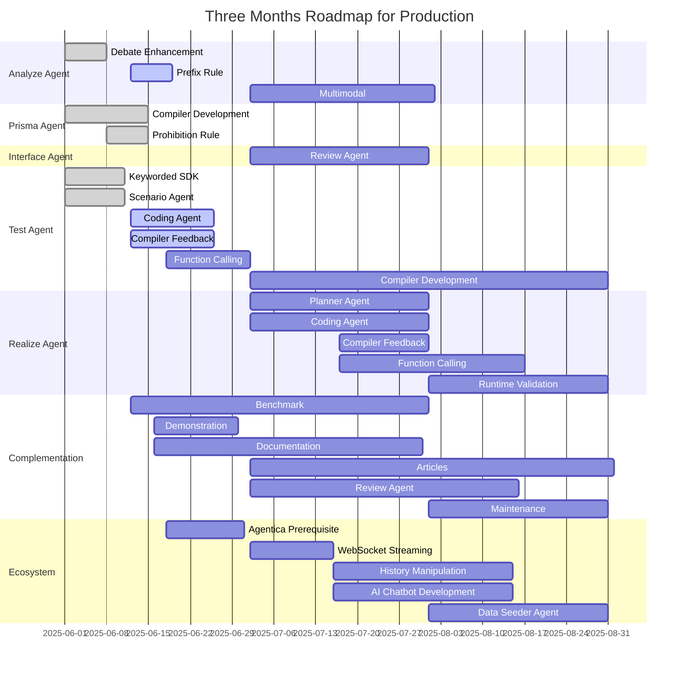

`@autobe`'s comprehensive three-month beta development roadmap spans from 2025-06-01 through 2025-08-31, marking a critical phase in our journey toward production readiness.

Following the successful completion of our alpha release on 2025-05-31, we have established a robust foundation with fully developed Analysis, Prisma, and Interface Agents. These core components have successfully automated the most complex challenges in backend development: comprehensive requirements analysis, intelligent database architecture, and seamless API design. This achievement represents a significant milestone in our mission to completely automate backend application design.

The upcoming beta phase strategically concentrates on delivering and refining the Test Agent and Realization Agent while ensuring system-wide stability and performance optimization across the entire `@autobe` ecosystem. Our ambitious target for 2025-08-31 is to achieve a breakthrough: a 100% reliable No-Code Agent platform that can autonomously handle any backend application development challenge without human intervention.