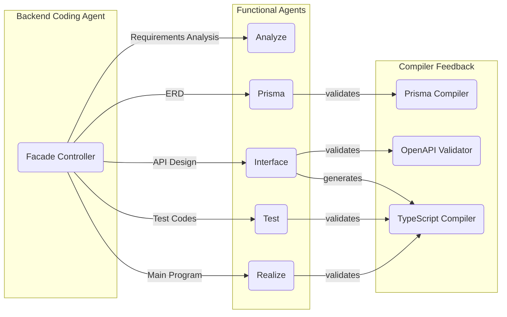

```mermaid
flowchart LR
subgraph "Backend Coding Agent"
  coder("Facade Controller")
end
subgraph "Functional Agents"
  coder --"Requirements Analysis"--> analyze("Analyze")
  coder --"ERD"--> prisma("Prisma")
  coder --"API Design"--> interface("Interface")
  coder --"Test Codes" --> test("Test")
  coder --"Main Program" --> realize("Realize")
end
subgraph "Compiler Feedback"
  prisma --"validates" --> prismaCompiler("Prisma Compiler")
  interface --"validates" --> openapiValidator("OpenAPI Validator")
  interface --"generates" --> tsCompiler("TypeScript Compiler")
  test --"validates" --> tsCompiler("TypeScript Compiler")
  realize --"validates" --> tsCompiler("TypeScript Compiler")
end
```